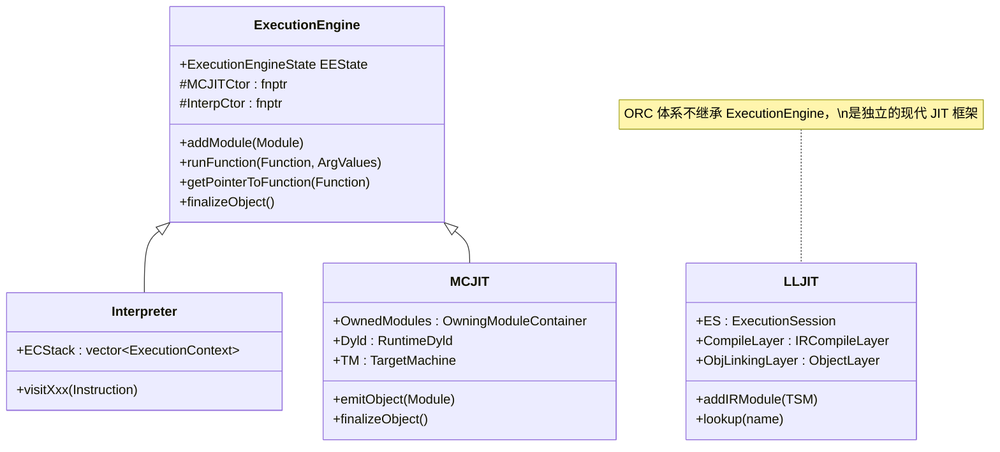
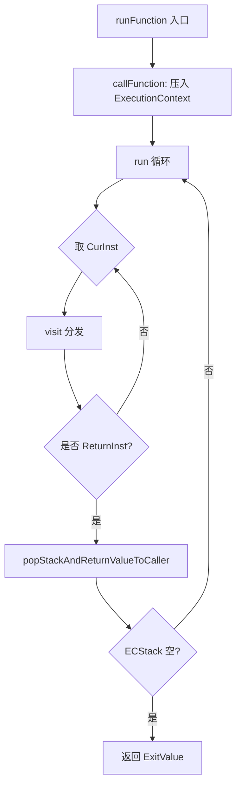
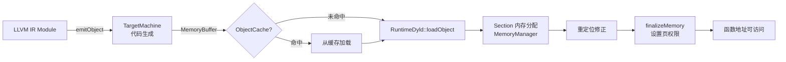
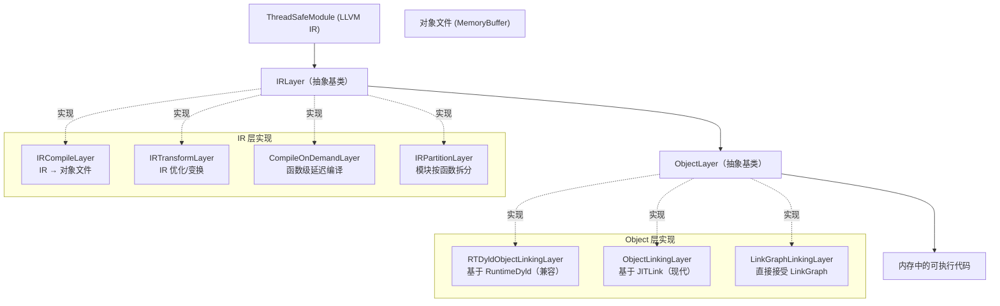
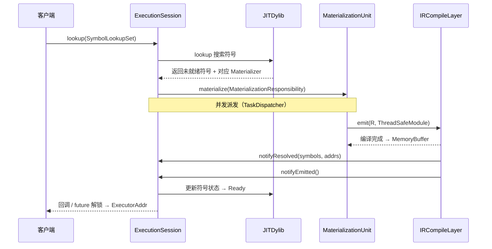
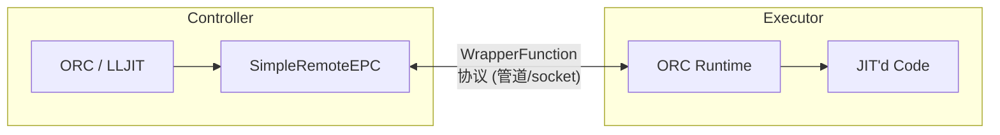

# LLVM JIT 架构深度解析

> 基于源码：`llvm/include/llvm/ExecutionEngine/` 及 `llvm/lib/ExecutionEngine/`

---

## 目录

1. [总体架构](#1-总体架构)
2. [Interpreter——解释执行](#2-interpreter解释执行)
3. [MCJIT——机器码 JIT](#3-mcjit机器码-jit)
4. [RuntimeDyld——动态链接器](#4-runtimedyld动态链接器)
5. [ORC JIT——现代分层 JIT](#5-orc-jit现代分层-jit)
6. [JITLink——现代链接器](#6-jitlink现代链接器)
7. [ExecutorProcessControl——执行器进程控制](#7-executorprocesscontrol执行器进程控制)
8. [横向对比](#8-横向对比)

---

## 1. 总体架构

LLVM 提供三类代码执行方式，共同继承自统一抽象基类 `ExecutionEngine`：

| 方式 | 实现类 | 特点 |
|------|--------|------|
| 解释执行 | `Interpreter` | 无代码生成，纯软件模拟 |
| 机器码 JIT | `MCJIT` | 整模块一次性编译为本机机器码 |
| ORC JIT | `LLJIT` / `LLLazyJIT` | 分层架构，支持增量/延迟编译 |

### 1.1 `ExecutionEngine` 抽象基类

> 源码：`include/llvm/ExecutionEngine/ExecutionEngine.h:99`

```
ExecutionEngine
├── addModule(unique_ptr<Module>)      // 添加 IR 模块
├── runFunction(Function*, ArgValues)  // 执行函数
├── getPointerToFunction(Function*)    // 获取函数地址
├── finalizeObject()                   // 最终化（MCJIT 特有语义）
└── getDataLayout() const
```

关键成员：
- `EEState`（`ExecutionEngineState`）：持有 `GlobalAddressMap`（符号名 → 地址映射）和反向映射。
- `MCJITCtor` / `InterpCtor`：静态函数指针，分别由 `MCJIT::Register()` 和 `Interpreter::Register()` 在程序启动时注入，`EngineBuilder` 通过这两个指针创建具体引擎实例。



---

## 2. Interpreter——解释执行

> 源码：`lib/ExecutionEngine/Interpreter/Interpreter.h`

### 2.1 设计原理

`Interpreter` 继承自 `ExecutionEngine` 和 `InstVisitor<Interpreter>`，采用访问者模式逐条解释 LLVM IR 指令，**不生成任何机器码**。

### 2.2 执行上下文栈

```cpp
// Interpreter.h:59
struct ExecutionContext {
    Function             *CurFunction;  // 当前执行的函数
    BasicBlock           *CurBB;        // 当前基本块
    BasicBlock::iterator  CurInst;      // 下一条待执行指令
    CallBase             *Caller;       // 调用者帧（顶层为 nullptr）
    std::map<Value*, GenericValue> Values; // 寄存器值映射
    std::vector<GenericValue> VarArgs;  // 变参列表
    AllocaHolder Allocas;               // alloca 内存跟踪（帧销毁时自动释放）
};

// 运行时调用栈
std::vector<ExecutionContext> ECStack;  // Interpreter.h:80
```

`AllocaHolder` 利用 RAII，在 `ExecutionContext` 出栈时自动释放所有 `alloca` 分配的内存。

### 2.3 指令分发

`InstVisitor<Interpreter>` 将每条指令路由到对应的 `visitXxx()` 方法：

```
visitReturnInst     visitBranchInst    visitSwitchInst
visitBinaryOperator visitICmpInst      visitFCmpInst
visitLoadInst       visitStoreInst     visitAllocaInst
visitGetElementPtrInst  visitCallBase  ...
```

`PHINode` 在进入基本块时由 `SwitchToNewBasicBlock()` 提前处理，因此其 `visit` 方法直接触发 `unreachable`。

### 2.4 执行流程



### 2.5 适用场景

- IR 级调试（无需目标平台）
- 正确性验证与单元测试
- 教学与原型验证

---

## 3. MCJIT——机器码 JIT

> 源码：`lib/ExecutionEngine/MCJIT/MCJIT.h`

### 3.1 设计定位

MCJIT 以**整个模块**为编译粒度，调用 `TargetMachine` 将 LLVM IR 编译为本机目标文件，再通过 `RuntimeDyld` 完成动态链接并映射到内存中执行。属于遗留方案（相对于 ORC），但仍广泛用于工具链集成。

### 3.2 模块状态机

```
              addModule()          generateCodeForModule()        finalizeObject()
  ─────────►  Added  ─────────────────────────────────────►  Loaded  ──────────►  Finalized
                 │                                                                      │
                 │              （引用时隐式触发 Loaded + Finalized）                    │
                 └──────────────────────────────────────────────────────────────────────┘
                                  getPointerToFunction() / getFunctionAddress()
```

内部由 `OwningModuleContainer` 维护三个 `SmallPtrSet<Module*>`：

```cpp
// MCJIT.h:158
ModulePtrSet AddedModules;
ModulePtrSet LoadedModules;
ModulePtrSet FinalizedModules;
```

### 3.3 核心成员

```cpp
// MCJIT.h:170
std::unique_ptr<TargetMachine> TM;         // 目标机器（负责代码生成）
std::shared_ptr<MCJITMemoryManager> MemMgr;// 内存管理器（分配代码/数据段）
LinkingSymbolResolver Resolver;            // 跨模块符号解析器
RuntimeDyld Dyld;                          // 动态链接器
ObjectCache *ObjCache;                     // 可选的对象缓存
```

### 3.4 编译管道



### 3.5 `LinkingSymbolResolver`

```cpp
// MCJIT.h:27
class LinkingSymbolResolver : public LegacyJITSymbolResolver {
    MCJIT &ParentEngine;
    shared_ptr<LegacyJITSymbolResolver> ClientResolver;

    JITSymbol findSymbol(const string &Name) override;
    // 先查 MCJIT 内部所有已加载模块，再委托 ClientResolver
};
```

当一个模块引用另一个模块的符号时，`LinkingSymbolResolver` 先在 `MCJIT` 管理的所有模块中查找（`findExistingSymbol`），找不到再委托用户提供的 `ClientResolver`（通常回退到 `dlsym`）。

### 3.6 ObjectCache

```cpp
// include/llvm/ExecutionEngine/ObjectCache.h
class ObjectCache {
    virtual void notifyObjectCompiled(const Module *M, MemoryBufferRef Obj);
    virtual unique_ptr<MemoryBuffer> getObject(const Module *M);
};
```

若 `getObject()` 返回非空，MCJIT 直接跳过编译，使用缓存的对象文件，可显著减少重复编译开销。

---

## 4. RuntimeDyld——动态链接器

> 源码：`lib/ExecutionEngine/RuntimeDyld/RuntimeDyldImpl.h`、`include/llvm/ExecutionEngine/RuntimeDyld.h`

### 4.1 职责

RuntimeDyld 是 MCJIT 的核心链接组件，负责：
1. 解析目标文件（ELF / Mach-O / COFF）中的 Section 和符号表
2. 调用 `MemoryManager` 分配内存并复制 Section 内容
3. 修正重定位（Relocation）——将符号引用替换为运行时地址
4. 通知 `MemoryManager` 最终化内存权限（代码段只读可执行）

### 4.2 核心数据结构

```cpp
// RuntimeDyldImpl.h:46
class SectionEntry {
    string   Name;          // Section 名（如 .text, .data）
    uint8_t *Address;       // 链接器本地地址（用于写入重定位结果）
    size_t   Size;          // Section 有效字节数
    uint64_t LoadAddress;   // 目标进程中的运行时地址
    uintptr_t StubOffset;   // ARM 等架构远跳桩区偏移
    size_t   AllocationSize;// 总分配大小（含桩区）
    uintptr_t ObjAddress;   // 对象文件中的原始地址（用于 Mach-O 重定位计算）
};
```

重定位条目（`RelocationEntry`）记录需修正的位置、类型及目标符号，由各平台子类（`RuntimeDyldELF`、`RuntimeDyldMachO`、`RuntimeDyldCOFF`）针对性处理。

### 4.3 MemoryManager 接口

```
RTDyldMemoryManager
├── allocateCodeSection(Size, Align, SectionID, Name) → uint8_t*
├── allocateDataSection(Size, Align, SectionID, Name, isReadOnly) → uint8_t*
├── finalizeMemory(ErrMsg) → bool   // 设置 RX/RW 页权限
└── notifyObjectLoaded(RTDyld, ObjFile)
```

用户可自定义 `MemoryManager` 以控制代码/数据段的内存布局，这是实现远程 JIT（代码在目标进程执行）的关键扩展点。

---

## 5. ORC JIT——现代分层 JIT

ORC（On-Request Compilation）是 LLVM 的现代 JIT 框架，以**分层架构**、**异步符号解析**和**完整并发支持**为核心设计目标。它不继承 `ExecutionEngine`，是独立的框架体系。

### 5.1 核心概念

#### `ExecutionSession`

> `include/llvm/ExecutionEngine/Orc/Core.h`

全局 JIT 协调器，持有所有 `JITDylib` 的注册表、`SymbolStringPool`（符号名字符串驻留池）和 `TaskDispatcher`（并发任务分发器）。所有对 JIT 状态的修改都通过 Session 锁序列化。

#### `JITDylib`

模拟动态库的符号表容器。每个 `JITDylib` 维护一张符号名到状态/地址的映射，并关联一个搜索顺序（`JITDylibSearchOrder`），符号查询沿该顺序在多个 `JITDylib` 中依次搜索。

LLJIT 默认创建三个 `JITDylib`：
- `ProcessSymbols`：宿主进程的非 JIT 符号（通过 `dlsym` 解析）
- `Platform`：ORC 运行时及平台符号
- `Main`：用户 JIT 代码

#### `MaterializationUnit`

> `include/llvm/ExecutionEngine/Orc/MaterializationUnit.h:32`

代表一组**可被延迟物质化**的符号定义。`JITDylib` 仅在符号被查询时才调用 `materialize()`，实现按需编译。

```cpp
class MaterializationUnit {
    SymbolFlagsMap SymbolFlags;    // 本 MU 提供哪些符号及其标志
    SymbolStringPtr InitSymbol;    // 初始化符号（用于运行 .init_array 等）

    virtual void materialize(unique_ptr<MaterializationResponsibility> R) = 0;
    virtual void discard(const JITDylib &JD, const SymbolStringPtr &Name) = 0;
};
```

#### `MaterializationResponsibility`

物质化权责凭证，由 `ExecutionSession` 生成并传递给 `materialize()`。凭证持有者有义务最终调用 `notifyResolved()` 和 `notifyEmitted()`，否则等待该符号的查询将永久阻塞。

#### `ResourceTracker`

> `Core.h:77`

代码生命周期管理句柄。每个加入 `JITDylib` 的 `MaterializationUnit` 都关联一个 `ResourceTracker`，调用 `RT->remove()` 可卸载对应的所有已编译代码和符号。

#### 符号状态机

> `Core.h:767`

```mermaid
stateDiagram-v2
    [*] --> NeverSearched : define() 注册符号
    NeverSearched --> Materializing : lookup() 触发物质化
    Materializing --> Resolved : notifyResolved() — 地址已确定
    Resolved --> Emitted : notifyEmitted() — 代码已写入内存
    Emitted --> Ready : 所有依赖 Ready 后传播
    Ready --> [*] : ResourceTracker::remove()
```

```cpp
enum class SymbolState : uint8_t {
    Invalid,       // 非法状态
    NeverSearched, // 已注册，从未被查询
    Materializing, // 被查询，物质化进行中
    Resolved,      // 地址已确定，仍在物质化
    Emitted,       // 已写入内存，等待依赖就绪
    Ready = 0x3f   // 完全就绪，客户端可安全访问
};
```

### 5.2 分层架构（Layer Model）

> `include/llvm/ExecutionEngine/Orc/Layer.h`

ORC 使用**层（Layer）**抽象将编译流程解耦，每层接收特定格式的输入，处理后向下传递。层分两大类：



#### `IRLayer` 与 `ObjectLayer` 接口

```cpp
// Layer.h:67
class IRLayer {
    ExecutionSession &ES;
    virtual void emit(unique_ptr<MaterializationResponsibility> R,
                      ThreadSafeModule TSM) = 0;
    // add() 默认实现：包装成 IRMaterializationUnit 注册到 JITDylib
};

class ObjectLayer {
    ExecutionSession &ES;
    virtual void emit(unique_ptr<MaterializationResponsibility> R,
                      unique_ptr<MemoryBuffer> O) = 0;
};
```

#### `IRCompileLayer`

> `include/llvm/ExecutionEngine/Orc/IRCompileLayer.h:31`

```cpp
class IRCompileLayer : public IRLayer {
    ObjectLayer &BaseLayer;             // 下游 Object 层
    unique_ptr<IRCompiler> Compile;     // 编译器（ConcurrentIRCompiler 等）

    void emit(unique_ptr<MaterializationResponsibility> R,
              ThreadSafeModule TSM) override;
    // 实现：调用 Compile(Module) → MemoryBuffer，转发给 BaseLayer
};
```

`IRCompiler` 是可替换的策略对象，默认实现为 `ConcurrentIRCompiler`（线程安全的 `TargetMachine` 封装）。

#### `CompileOnDemandLayer`

> `include/llvm/ExecutionEngine/Orc/CompileOnDemandLayer.h:55`

```cpp
class CompileOnDemandLayer : public IRLayer {
    IRLayer &BaseLayer;
    LazyCallThroughManager &LCTMgr;       // 管理延迟调用桩
    IndirectStubsManagerBuilder BuildISMgr; // 构建间接桩管理器

    void emit(unique_ptr<MaterializationResponsibility> R,
              ThreadSafeModule TSM) override;
    // 实现：
    //   1. 扫描模块中所有函数
    //   2. 为每个函数创建间接跳转桩（IndirectStub）
    //   3. 桩指向 LazyCallThrough 回调
    //   4. 首次调用时触发单函数编译，更新桩地址
};
```

### 5.3 LLJIT 与 LLLazyJIT

> `include/llvm/ExecutionEngine/Orc/LLJIT.h`

#### `LLJIT`——即时编译（Eager）

```
LLJIT
├── ExecutionSession ES
├── JITDylib *ProcessSymbols / *Platform / *Main
├── ObjectLayer ObjLinkingLayer       ← RTDyldObjectLinkingLayer 或 ObjectLinkingLayer
├── ObjectTransformLayer ObjTransformLayer
├── IRCompileLayer CompileLayer       ← 调用 IRCompiler 编译
└── IRTransformLayer TransformLayer   ← 用户注入的 IR 优化 pass

核心 API：
  addIRModule(ThreadSafeModule)     // 注册 IR 模块（延迟到 lookup 时编译）
  lookup(StringRef Name)            // 触发编译 + 返回 ExecutorAddr
```

`LLJIT::lookup()` 是同步接口：内部发起异步 `ExecutionSession::lookup()`，用 `std::promise/future` 阻塞等待完成。

#### `LLLazyJIT`——延迟编译（Lazy）

```cpp
// LLJIT.h:268
class LLLazyJIT : public LLJIT {
    IRPartitionLayer *IPLayer;       // 将模块拆分为单函数片段
    CompileOnDemandLayer *CODLayer;  // 函数级延迟编译
    // ...
};
```

`LLLazyJIT` 在 `LLJIT` 层栈中插入了 `IRPartitionLayer` + `CompileOnDemandLayer`：
- `IRPartitionLayer`：将整个 IR 模块按函数拆分，每个函数作为独立 `MaterializationUnit`
- `CompileOnDemandLayer`：为每个函数生成间接跳转桩，首次调用时编译真正代码

### 5.4 符号解析异步流程



---

## 6. JITLink——现代链接器

> `include/llvm/ExecutionEngine/JITLink/JITLink.h`、`lib/ExecutionEngine/JITLink/`

### 6.1 设计定位

JITLink 是 RuntimeDyld 的现代替代品，以**通用链接图（LinkGraph）**为核心表示，从根本上解决了 RuntimeDyld 的架构局限（每次新增架构/格式都需大量重复代码）。

### 6.2 `LinkGraph`

`LinkGraph` 是目标文件解析后的内存图表示，包含三类节点：

```
LinkGraph
├── Section[]          ← 各 Section（.text, .data, .rodata …）
│   └── Block[]        ← Section 内的原子代码/数据块
│       └── Edge[]     ← 指向其他 Symbol 的重定位引用
└── Symbol[]           ← 所有符号（定义符号 + 外部符号）
    └── targetBlock / offset
```

```cpp
// JITLink.h:66
class Edge {
    Kind      kind;     // 重定位类型（架构相关，如 R_X86_64_PC32）
    OffsetT   offset;   // 在源 Block 中的偏移
    AddendT   addend;   // 加数
    Symbol   *target;   // 目标符号
};
```

### 6.3 支持的对象格式

| 格式 | 架构覆盖 |
|------|----------|
| ELF | x86、x86-64、AArch64、RISC-V、LoongArch、PPC64 |
| Mach-O | AArch64（arm64） |
| COFF | x86-64 |

### 6.4 链接器插件（Pass）

JITLink 通过**插件（Plugin）**机制在链接图上添加操作，这是相比 RuntimeDyld 最重要的架构差异：

```
JITLinker 执行流程：
  1. 解析对象文件 → 构建 LinkGraph
  2. 运行 pre-prune passes（用户/平台插件）
  3. 剪除死代码（prune）
  4. 运行 post-prune passes
  5. 分配内存（JITLinkMemoryManager）
  6. 运行 pre-fixup passes
  7. 修正重定位（apply fixups）
  8. 运行 post-fixup passes
  9. 最终化内存权限
  10. 通知 MaterializationResponsibility → notifyResolved / notifyEmitted
```

内置插件包括：`EHFrameRegistrationPlugin`（注册异常帧）、`DebugObjectManagerPlugin`（调试信息注册）等。

### 6.5 与 ORC 的集成

`ObjectLinkingLayer`（`include/llvm/ExecutionEngine/Orc/`）是 ORC 中对接 JITLink 的 `ObjectLayer` 实现，将 `emit()` 请求转发给 JITLink，并在链接完成后调用 `notifyResolved` / `notifyEmitted`。

---

## 7. ExecutorProcessControl——执行器进程控制

> `include/llvm/ExecutionEngine/Orc/ExecutorProcessControl.h`

### 7.1 抽象

`ExecutorProcessControl`（EPC）将"**JIT 编译器进程**"与"**执行器进程**"解耦：

```
┌─────────────────────┐        EPC 接口         ┌──────────────────────┐
│  Controller Process │ ◄──────────────────────► │  Executor Process    │
│  (执行 ORC/LLVM)    │   WrapperFunctionResult  │  (运行 JIT'd 代码)   │
└─────────────────────┘                          └──────────────────────┘
```

EPC 暴露的核心能力：
- **内存管理**：通过 `JITLinkMemoryManager` 在执行器中分配/写入/保护内存
- **符号查询**：在执行器进程的动态库中查找符号（`DylibManager`）
- **远程调用**：`callWrapper()` 在执行器中调用 bootstrap 函数

### 7.2 进程内执行

`SelfExecutorProcessControl`：编译器与执行器是同一进程，直接使用本地内存和函数指针，是默认配置（LLJIT 构建时若无指定 EPC 则自动创建）。

### 7.3 进程外执行（远程 JIT）

`SimpleRemoteEPC` + `EPCGenericJITLinkMemoryManager`：通过管道/socket 与独立执行器进程通信，实现：
- 交叉编译（controller 为 x86-64，executor 为 AArch64 嵌入式目标）
- 沙箱执行（JIT 代码在隔离进程中运行）
- 远程调试



---

## 8. 横向对比

| 维度 | Interpreter | MCJIT | ORC LLJIT | ORC LLLazyJIT |
|------|-------------|-------|-----------|---------------|
| **编译粒度** | 无（逐指令解释）| 整模块 | 整模块 | 单函数 |
| **代码生成** | 无 | `TargetMachine` | `IRCompileLayer` | `CompileOnDemandLayer` |
| **链接器** | 无 | RuntimeDyld | RTDyld 或 JITLink | RTDyld 或 JITLink |
| **延迟编译** | 不适用 | 模块级懒加载 | 否（查询即编译）| 是（首次调用编译）|
| **并发安全** | 有限（单线程）| 基础（全局锁）| 完整（ES Session 锁 + Task 并发）| 完整 |
| **远程执行** | 否 | 有限（需自定义 MemoryManager）| 是（EPC）| 是（EPC）|
| **推荐场景** | 调试/验证/教学 | 遗留项目维护 | 新 JIT 项目首选 | 大代码库/启动时间敏感 |
| **继承 ExecutionEngine** | 是 | 是 | 否（独立框架）| 否（独立框架）|

---

## 关键源码文件速查

| 文件 | 用途 |
|------|------|
| `include/llvm/ExecutionEngine/ExecutionEngine.h` | 执行引擎抽象基类 |
| `include/llvm/ExecutionEngine/JITSymbol.h` | 符号标志与延迟求值符号 |
| `include/llvm/ExecutionEngine/RuntimeDyld.h` | 动态链接器公开接口 |
| `lib/ExecutionEngine/MCJIT/MCJIT.h` | MCJIT 内部结构与状态机 |
| `lib/ExecutionEngine/Interpreter/Interpreter.h` | 解释器结构与访问者方法 |
| `lib/ExecutionEngine/RuntimeDyld/RuntimeDyldImpl.h` | RuntimeDyld 内部实现（SectionEntry 等）|
| `include/llvm/ExecutionEngine/Orc/MaterializationUnit.h` | 物质化单元抽象 |
| `include/llvm/ExecutionEngine/Orc/Core.h` | ORC 核心（ES、JITDylib、SymbolState）|
| `include/llvm/ExecutionEngine/Orc/Layer.h` | IRLayer / ObjectLayer 接口 |
| `include/llvm/ExecutionEngine/Orc/IRCompileLayer.h` | IR 编译层 |
| `include/llvm/ExecutionEngine/Orc/IRTransformLayer.h` | IR 变换层 |
| `include/llvm/ExecutionEngine/Orc/CompileOnDemandLayer.h` | 延迟编译层 |
| `include/llvm/ExecutionEngine/Orc/LLJIT.h` | 高层 JIT API（LLJIT / LLLazyJIT）|
| `include/llvm/ExecutionEngine/Orc/ExecutorProcessControl.h` | EPC 抽象与进程内实现 |
| `include/llvm/ExecutionEngine/JITLink/JITLink.h` | 现代链接器接口（LinkGraph、Edge）|
