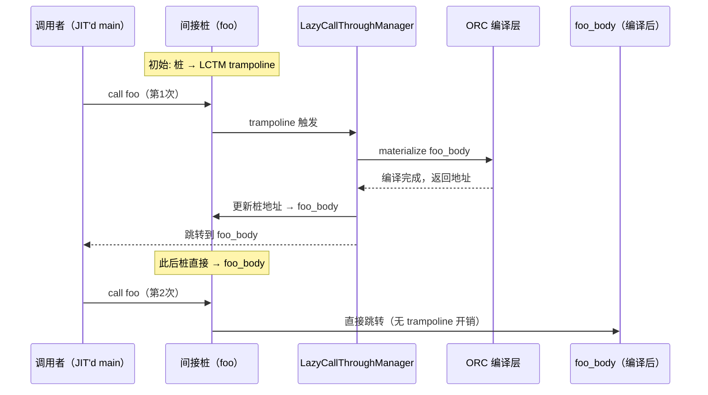

# LLVM ORC v2 使用指南

> 代码示例均来自 `llvm/examples/HowToUseLLJIT/` 及 `llvm/examples/OrcV2Examples/`，
> 可直接对应源码阅读。

---

## 目录

1. [初始化与最小可运行示例](#1-初始化与最小可运行示例)
2. [从字符串 IR 构建模块](#2-从字符串-ir-构建模块)
3. [多 JITDylib 与代码卸载](#3-多-jitdylib-与代码卸载)
4. [IR 优化变换层](#4-ir-优化变换层)
5. [惰性重导出（Lazy Reexports）](#5-惰性重导出lazy-reexports)
6. [对象缓存（ObjectCache）](#6-对象缓存objectcache)
7. [切换到 JITLink 链接层](#7-切换到-jitlink-链接层)
8. [JITLink 插件（Pass Plugin）](#8-jitlink-插件pass-plugin)
9. [错误处理模式](#9-错误处理模式)
10. [常见构建选项速查](#10-常见构建选项速查)

---

## 1. 初始化与最小可运行示例

> 源码：`llvm/examples/HowToUseLLJIT/HowToUseLLJIT.cpp`

### 1.1 必须完成的全局初始化

```cpp
#include "llvm/Support/InitLLVM.h"
#include "llvm/Support/TargetSelect.h"

int main(int argc, char *argv[]) {
    InitLLVM X(argc, argv);              // 初始化信号处理、崩溃报告

    InitializeNativeTarget();            // 注册宿主架构的 TargetMachine
    InitializeNativeTargetAsmPrinter();  // 注册汇编打印器（代码生成必须）
    // ...
}
```

`InitializeNativeTarget()` 只注册当前运行平台的后端；若需要交叉编译，改用
`InitializeAllTargets()` + `InitializeAllTargetMCs()` + `InitializeAllAsmPrinters()`。

### 1.2 用 IRBuilder 构造模块

```cpp
#include "llvm/ExecutionEngine/Orc/ThreadSafeModule.h"
#include "llvm/IR/IRBuilder.h"
#include "llvm/IR/Module.h"

// 返回 ThreadSafeModule（ORC 要求的线程安全模块包装）
ThreadSafeModule createDemoModule() {
    // Context 和 Module 必须成对封装进 ThreadSafeModule
    auto Context = std::make_unique<LLVMContext>();
    auto M = std::make_unique<Module>("demo", *Context);

    // 创建 int add1(int x) { return x + 1; }
    Function *F = Function::Create(
        FunctionType::get(Type::getInt32Ty(*Context),
                          {Type::getInt32Ty(*Context)}, /*isVarArg=*/false),
        Function::ExternalLinkage, "add1", M.get());

    BasicBlock *BB = BasicBlock::Create(*Context, "entry", F);
    IRBuilder<> Builder(BB);

    Argument *ArgX = &*F->arg_begin();
    ArgX->setName("x");
    Builder.CreateRet(Builder.CreateAdd(Builder.getInt32(1), ArgX));

    // Context 所有权一并转移给 ThreadSafeModule
    return ThreadSafeModule(std::move(M), std::move(Context));
}
```

**关键点**：`LLVMContext` 不是线程安全的，`ThreadSafeModule` 内部持有一把互斥锁，确保
多线程 ORC 并发编译时对 Module 的访问是串行的。

### 1.3 创建 LLJIT 并执行

```cpp
#include "llvm/ExecutionEngine/Orc/LLJIT.h"

ExitOnError ExitOnErr;   // 错误时直接退出（示例常用，生产代码请用 Expected<T>）

auto J = ExitOnErr(LLJITBuilder().create());  // ① 构建 LLJIT 实例

ExitOnErr(J->addIRModule(createDemoModule())); // ② 注册模块（此时尚未编译）

auto Addr = ExitOnErr(J->lookup("add1"));      // ③ 触发编译 + 返回地址
int (*Add1)(int) = Addr.toPtr<int(int)>();     // ④ 转换为函数指针

outs() << "add1(42) = " << Add1(42) << "\n";  // ⑤ 执行 JIT'd 代码
```

`lookup()` 是触发编译的关键调用——ORC 采用**按需物质化**模型，模块注册时不编译，
首次 `lookup()` 时才调用编译层，将 IR 转为机器码并完成链接。

### 1.4 完整数据流

```mermaid
flowchart LR
    A["ThreadSafeModule\n(LLVM IR)"]
    B["addIRModule()\n注册为 MaterializationUnit"]
    C["lookup(\"add1\")\n触发物质化"]
    D["IRTransformLayer\n(可选优化)"]
    E["IRCompileLayer\nTargetMachine → 对象文件"]
    F["ObjectLayer\n(RTDyld / JITLink)"]
    G["ExecutorAddr\n(函数地址)"]
    H["toPtr<FnType>()\n转函数指针 → 调用"]

    A --> B --> C --> D --> E --> F --> G --> H
```

---

## 2. 从字符串 IR 构建模块

> 源码：`llvm/examples/OrcV2Examples/ExampleModules.h`

直接编写 IR 文本（`.ll` 格式）是快速测试的常用方式，
`parseIR()` 将字符串解析为 `Module`：

```cpp
#include "llvm/IRReader/IRReader.h"
#include "llvm/Support/SourceMgr.h"

Expected<ThreadSafeModule>
parseModuleFromString(StringRef IRText, StringRef ModuleName) {
    auto Ctx = std::make_unique<LLVMContext>();
    SMDiagnostic Err;
    // MemoryBufferRef 包装字符串，不发生拷贝
    if (auto M = parseIR(MemoryBufferRef(IRText, ModuleName), Err, *Ctx))
        return ThreadSafeModule(std::move(M), std::move(Ctx));

    // 将 SMDiagnostic 转换为 llvm::Error
    std::string Msg;
    raw_string_ostream OS(Msg);
    Err.print("", OS);
    return make_error<StringError>(std::move(Msg), inconvertibleErrorCode());
}
```

使用示例：

```cpp
// IR 文本内联定义
const StringRef FacMod = R"(
  define i32 @fac(i32 %n) {
  entry:
    %tobool = icmp eq i32 %n, 0
    br i1 %tobool, label %ret, label %rec
  rec:
    %n1  = add nsw i32 %n, -1
    %r   = call i32 @fac(i32 %n1)
    %res = mul nsw i32 %n, %r
    br label %ret
  ret:
    %v = phi i32 [ %res, %rec ], [ 1, %entry ]
    ret i32 %v
  }
)";

auto J = ExitOnErr(LLJITBuilder().create());
ExitOnErr(J->addIRModule(ExitOnErr(parseModuleFromString(FacMod, "fac"))));

auto FacAddr = ExitOnErr(J->lookup("fac"));
int (*Fac)(int) = FacAddr.toPtr<int(int)>();
outs() << "fac(5) = " << Fac(5) << "\n";  // 输出 120
```

从文件加载 IR（`.ll` 或 `.bc`）：

```cpp
#include "llvm/IRReader/IRReader.h"

Expected<ThreadSafeModule> loadIRFile(StringRef Path) {
    auto Ctx = std::make_unique<LLVMContext>();
    SMDiagnostic Err;
    if (auto M = parseIRFile(Path, Err, *Ctx))
        return ThreadSafeModule(std::move(M), std::move(Ctx));
    // 同上错误转换 ...
}
```

---

## 3. 多 JITDylib 与代码卸载

> 源码：`llvm/examples/OrcV2Examples/LLJITRemovableCode/LLJITRemovableCode.cpp`

### 3.1 创建自定义 JITDylib

```cpp
auto J = ExitOnErr(LLJITBuilder().create());

// 创建一个名为 "MyLib" 的新 JITDylib（名称在 ExecutionSession 内唯一）
auto &MyLib = ExitOnErr(J->createJITDylib("MyLib"));

// 将模块加入 MyLib（而不是默认的 Main JITDylib）
ExitOnErr(J->addIRModule(MyLib, ExitOnErr(parseModuleFromString(FooIR, "foo"))));

// 在 MyLib 中查找符号
auto FooAddr = ExitOnErr(J->lookup(MyLib, "foo"));
```

### 3.2 ResourceTracker：细粒度代码卸载

```
JITDylib
├── 默认 ResourceTracker（JD 生命周期）
│   └── foo 模块（无显式 RT，绑定到默认 RT）
├── BarRT（显式 ResourceTracker）
│   └── bar 模块
└── BazRT（显式 ResourceTracker）
    └── baz 模块
```

```cpp
auto &JD = ExitOnErr(J->createJITDylib("JD"));

// 使用默认 RT 添加 foo（无法单独卸载，随 JD 销毁）
ExitOnErr(J->addIRModule(JD, ExitOnErr(parseModuleFromString(FooIR, "foo"))));

// 为 bar 和 baz 分别创建独立 RT
auto BarRT = JD.createResourceTracker();
ExitOnErr(J->addIRModule(BarRT, ExitOnErr(parseModuleFromString(BarIR, "bar"))));

auto BazRT = JD.createResourceTracker();
ExitOnErr(J->addIRModule(BazRT, ExitOnErr(parseModuleFromString(BazIR, "baz"))));
```

### 3.3 三种卸载操作

```cpp
// ① RT 置空 → 所有权转移给 JD 的默认 RT（符号仍然可用）
BazRT = nullptr;

// ② RT::remove() → 立即卸载 bar 的代码和符号（不可再 lookup "bar"）
ExitOnErr(BarRT->remove());

// ③ JD::clear() → 清空 JD 内所有符号（foo、baz 全部删除）
ExitOnErr(JD.clear());

// ④ 从 ExecutionSession 移除 JD（JD 指针失效，不可再用）
ExitOnErr(J->getExecutionSession().removeJITDylib(JD));
```

### 3.4 ResourceTracker 转移

```cpp
// 将 BarRT 的所有资源转移给 BazRT（BarRT 变为 defunct）
BarRT->transferTo(*BazRT);
// 此后 remove(BazRT) 会同时删除原 bar + baz 的代码
```

---

## 4. IR 优化变换层

> 源码：`llvm/examples/OrcV2Examples/LLJITWithOptimizingIRTransform/LLJITWithOptimizingIRTransform.cpp`

`IRTransformLayer` 是 LLJIT 层栈中位于 `IRCompileLayer` 之上的可注入变换点，
每个模块在被编译前都会经过此变换。

### 4.1 注入变换函数（Lambda）

```cpp
// 最简形式：只打印模块，不做任何修改
J->getIRTransformLayer().setTransform(
    [](ThreadSafeModule TSM,
       const MaterializationResponsibility &R) -> Expected<ThreadSafeModule> {
        // withModuleDo 在持有内部互斥锁的情况下访问 Module
        TSM.withModuleDo([](Module &M) {
            dbgs() << "Compiling module: " << M.getName() << "\n";
        });
        return std::move(TSM);  // 必须返回（可能已修改的）TSM
    });
```

### 4.2 注入优化 Pass 管理器（函数对象）

```cpp
#include "llvm/IR/LegacyPassManager.h"
#include "llvm/Transforms/Scalar.h"
#include "llvm/Transforms/IPO.h"

class OptTransform {
public:
    OptTransform() : PM(std::make_unique<legacy::PassManager>()) {
        PM->add(createTailCallEliminationPass());
        PM->add(createCFGSimplificationPass());
    }

    Expected<ThreadSafeModule>
    operator()(ThreadSafeModule TSM, MaterializationResponsibility &R) {
        TSM.withModuleDo([this](Module &M) {
            PM->run(M);
        });
        return std::move(TSM);
    }

private:
    std::unique_ptr<legacy::PassManager> PM;
};

// 安装到 LLJIT（在 addIRModule 之前设置）
J->getIRTransformLayer().setTransform(OptTransform());
```

### 4.3 使用新 Pass Manager（PassBuilder）

```cpp
#include "llvm/Passes/PassBuilder.h"

J->getIRTransformLayer().setTransform(
    [](ThreadSafeModule TSM,
       const MaterializationResponsibility &R) -> Expected<ThreadSafeModule> {
        TSM.withModuleDo([](Module &M) {
            PassBuilder PB;
            LoopAnalysisManager LAM;
            FunctionAnalysisManager FAM;
            CGSCCAnalysisManager CGAM;
            ModuleAnalysisManager MAM;
            PB.registerModuleAnalyses(MAM);
            PB.registerCGSCCAnalyses(CGAM);
            PB.registerFunctionAnalyses(FAM);
            PB.registerLoopAnalyses(LAM);
            PB.crossRegisterProxies(LAM, FAM, CGAM, MAM);

            ModulePassManager MPM =
                PB.buildPerModuleDefaultPipeline(OptimizationLevel::O2);
            MPM.run(M, MAM);
        });
        return std::move(TSM);
    });
```

---

## 5. 惰性重导出（Lazy Reexports）

> 源码：`llvm/examples/OrcV2Examples/LLJITWithLazyReexports/LLJITWithLazyReexports.cpp`

`lazyReexports` 是手动实现函数级延迟编译的底层 API——为某个符号创建一个**间接跳转桩**，
桩首次被调用时才触发真正函数的编译，之后桩地址被更新，后续调用直接跳转。

### 5.1 核心组件

| 组件 | 职责 |
|------|------|
| `IndirectStubsManager` | 管理一批间接跳转桩（每桩 8 字节 + 一个跳转指令）|
| `LazyCallThroughManager` | 处理首次调用的 trampoline，触发编译后更新桩地址 |
| `SymbolAliasMap` | 定义 `公开名 → 实现名` 的重导出映射 |

### 5.2 完整步骤

```cpp
#include "llvm/ExecutionEngine/Orc/IndirectionUtils.h"
#include "llvm/ExecutionEngine/Orc/LazyReexports.h"

auto J = ExitOnErr(LLJITBuilder().create());

// ① 创建 IndirectStubsManager（平台相关：x86-64 使用 8 字节桩）
auto ISMBuilder =
    createLocalIndirectStubsManagerBuilder(J->getTargetTriple());
auto ISM = ISMBuilder();

// ② 创建 LazyCallThroughManager（错误地址 = 0，表示无默认错误处理）
auto LCTM = ExitOnErr(createLocalLazyCallThroughManager(
    J->getTargetTriple(), J->getExecutionSession(), ExecutorAddr()));

// ③ 添加实现模块（函数名加 _body 后缀，避免与桩名冲突）
// FooMod 中定义 @foo_body，BarMod 中定义 @bar_body
ExitOnErr(J->addIRModule(ExitOnErr(parseModuleFromString(FooMod, "foo-mod"))));
ExitOnErr(J->addIRModule(ExitOnErr(parseModuleFromString(BarMod, "bar-mod"))));

// ④ 添加调用者模块（声明 @foo 和 @bar，实际调用公开名）
ExitOnErr(J->addIRModule(ExitOnErr(parseModuleFromString(MainMod, "main-mod"))));

// ⑤ 定义惰性重导出：foo → foo_body，bar → bar_body
SymbolAliasMap ReExports = {
    {J->mangleAndIntern("foo"),
     {J->mangleAndIntern("foo_body"),
      JITSymbolFlags::Exported | JITSymbolFlags::Callable}},
    {J->mangleAndIntern("bar"),
     {J->mangleAndIntern("bar_body"),
      JITSymbolFlags::Exported | JITSymbolFlags::Callable}},
};
ExitOnErr(J->getMainJITDylib().define(
    lazyReexports(*LCTM, *ISM, J->getMainJITDylib(), std::move(ReExports))));

// ⑥ lookup entry 时，entry 模块被编译；foo/bar 模块尚未编译
auto EntryAddr = ExitOnErr(J->lookup("entry"));
auto *Entry = EntryAddr.toPtr<int(int)>();

// 若 argc 为奇数，调用 foo() → 触发 FooMod 编译；否则调用 bar()
int Result = Entry(argc);
```

### 5.3 执行流程



---

## 6. 对象缓存（ObjectCache）

> 源码：`llvm/examples/OrcV2Examples/LLJITWithObjectCache/LLJITWithObjectCache.cpp`

对象缓存将编译结果（`.o` 文件内容）保存在内存或磁盘，下次遇到相同模块时直接跳过编译。

### 6.1 实现 ObjectCache

```cpp
#include "llvm/ExecutionEngine/ObjectCache.h"

class MyObjectCache : public ObjectCache {
public:
    // 编译完成后回调：将对象文件内容存入 map
    void notifyObjectCompiled(const Module *M,
                              MemoryBufferRef ObjBuffer) override {
        CachedObjects[M->getModuleIdentifier()] =
            MemoryBuffer::getMemBufferCopy(
                ObjBuffer.getBuffer(), ObjBuffer.getBufferIdentifier());
    }

    // 查询缓存：返回 nullptr 表示未命中（触发重新编译）
    std::unique_ptr<MemoryBuffer> getObject(const Module *M) override {
        auto It = CachedObjects.find(M->getModuleIdentifier());
        if (It == CachedObjects.end())
            return nullptr;  // cache miss
        // 返回缓冲区副本（调用方取得所有权）
        return MemoryBuffer::getMemBuffer(It->second->getMemBufferRef());
    }

private:
    StringMap<std::unique_ptr<MemoryBuffer>> CachedObjects;
};
```

### 6.2 将 ObjectCache 注入 LLJIT

ORC 的 `IRCompileLayer` 默认使用 `ConcurrentIRCompiler`，它不接受 `ObjectCache`
参数。需要通过 `setCompileFunctionCreator` 改用 `TMOwningSimpleCompiler`：

```cpp
#include "llvm/ExecutionEngine/Orc/CompileUtils.h"  // TMOwningSimpleCompiler

MyObjectCache MyCache;

auto J = ExitOnErr(
    LLJITBuilder()
        .setCompileFunctionCreator(
            [&](JITTargetMachineBuilder JTMB)
                -> Expected<std::unique_ptr<IRCompileLayer::IRCompiler>> {
                auto TM = JTMB.createTargetMachine();
                if (!TM)
                    return TM.takeError();
                // TMOwningSimpleCompiler 接受 ObjectCache 指针
                return std::make_unique<TMOwningSimpleCompiler>(
                    std::move(*TM), &MyCache);
            })
        .create());

ExitOnErr(J->addIRModule(ExitOnErr(parseModuleFromString(Add1IR, "add1"))));
auto Addr = ExitOnErr(J->lookup("add1"));  // 第1次：编译 + 写入缓存

// 第2次创建新的 LLJIT 实例，使用同一个 MyCache
auto J2 = ExitOnErr(
    LLJITBuilder()
        .setCompileFunctionCreator(/* 同上，传入 MyCache */)
        .create());
ExitOnErr(J2->addIRModule(ExitOnErr(parseModuleFromString(Add1IR, "add1"))));
auto Addr2 = ExitOnErr(J2->lookup("add1"));  // 第2次：直接从缓存加载，跳过编译
```

**注意**：ORC 中模块匹配依赖 `Module::getModuleIdentifier()`，即 `Module` 构造时传入的名称字符串。两次 `parseModuleFromString` 传入相同 `ModuleName` 是缓存命中的前提。

---

## 7. 切换到 JITLink 链接层

> 源码：`llvm/examples/OrcV2Examples/LLJITWithCustomObjectLinkingLayer/LLJITWithCustomObjectLinkingLayer.cpp`

LLJIT 默认使用 `RTDyldObjectLinkingLayer`（基于 RuntimeDyld），可通过
`setObjectLinkingLayerCreator` 替换为 `ObjectLinkingLayer`（基于 JITLink）。

### 7.1 切换链接层

```cpp
#include "llvm/ExecutionEngine/Orc/ObjectLinkingLayer.h"
#include "llvm/ExecutionEngine/JITLink/JITLinkMemoryManager.h"

// 检测宿主平台，明确指定 Small 代码模型（JITLink 推荐）
auto JTMB = ExitOnErr(JITTargetMachineBuilder::detectHost());
JTMB.setCodeModel(CodeModel::Small);

auto J = ExitOnErr(
    LLJITBuilder()
        .setJITTargetMachineBuilder(std::move(JTMB))
        .setObjectLinkingLayerCreator(
            [&](ExecutionSession &ES) {
                // InProcessMemoryManager：在当前进程内分配可执行内存
                return std::make_unique<ObjectLinkingLayer>(
                    ES,
                    ExitOnErr(jitlink::InProcessMemoryManager::Create()));
            })
        .create());

ExitOnErr(J->addIRModule(ExitOnErr(parseModuleFromString(Add1IR, "add1"))));
auto Addr = ExitOnErr(J->lookup("add1"));
```

### 7.2 RTDyld vs JITLink 对比

| 维度 | RTDyldObjectLinkingLayer | ObjectLinkingLayer (JITLink) |
|------|--------------------------|------------------------------|
| 核心数据结构 | `SectionEntry` + 重定位列表 | `LinkGraph`（节点图）|
| 扩展机制 | 继承 `RuntimeDyldImpl` | 插件（Plugin）+ Pass |
| 跨架构 | 每个架构子类独立实现 | 通用接口，架构差异在 fixup 层 |
| 远程执行支持 | 有限（自定义 MemoryManager）| 完整（EPC + JITLinkMemoryManager）|
| 推荐场景 | 已有 MCJIT 代码迁移 | 新项目首选 |

---

## 8. JITLink 插件（Pass Plugin）

> 源码：`llvm/examples/OrcV2Examples/LLJITWithObjectLinkingLayerPlugin/LLJITWithObjectLinkingLayerPlugin.cpp`

`ObjectLinkingLayer::Plugin` 允许在 JITLink 链接图的各个阶段注入自定义操作，
是实现调试信息注册、内存权限监控、代码插桩等功能的核心扩展点。

### 8.1 Plugin 接口

```cpp
class ObjectLinkingLayer::Plugin {
public:
    // 修改 JITLink pass 配置（最常用：在 Config.PostPrunePasses 中添加自定义 pass）
    virtual void modifyPassConfig(MaterializationResponsibility &MR,
                                  jitlink::LinkGraph &LG,
                                  jitlink::PassConfiguration &Config) {}

    // 对象已加载通知（地址尚未分配）
    virtual void notifyLoaded(MaterializationResponsibility &MR) {}

    // 对象已 emit 通知（地址已分配，内存权限已设置）
    virtual Error notifyEmitted(MaterializationResponsibility &MR) {
        return Error::success();
    }

    // 物质化失败通知
    virtual Error notifyFailed(MaterializationResponsibility &MR) = 0;

    // 资源卸载通知
    virtual Error notifyRemovingResources(JITDylib &JD, ResourceKey K) = 0;

    // 资源转移通知
    virtual void notifyTransferringResources(JITDylib &JD,
                                             ResourceKey DstKey,
                                             ResourceKey SrcKey) = 0;
};
```

### 8.2 实现一个简单的诊断插件

```cpp
class DiagPlugin : public ObjectLinkingLayer::Plugin {
public:
    void modifyPassConfig(MaterializationResponsibility &MR,
                          jitlink::LinkGraph &LG,
                          jitlink::PassConfiguration &Config) override {
        // PostPrunePasses：死代码剪除后、地址分配前运行
        Config.PostPrunePasses.push_back([](jitlink::LinkGraph &G) -> Error {
            outs() << "Linking graph: " << G.getName() << "\n";
            for (auto &S : G.sections()) {
                outs() << "  Section: " << S.getName() << "\n";
                for (auto *Sym : S.symbols()) {
                    if (Sym->hasName())
                        outs() << "    Symbol: " << Sym->getName() << "\n";
                }
            }
            return Error::success();
        });

        // PostFixupPasses：重定位修正后运行（地址已确定）
        Config.PostFixupPasses.push_back([](jitlink::LinkGraph &G) -> Error {
            for (auto &S : G.sections()) {
                for (auto *Sym : S.symbols()) {
                    if (Sym->hasName())
                        outs() << Sym->getName() << " @ "
                               << formatv("{0:x}", Sym->getAddress()) << "\n";
                }
            }
            return Error::success();
        });
    }

    void notifyLoaded(MaterializationResponsibility &MR) override {
        outs() << "Loaded: " << MR.getSymbols() << "\n";
    }

    Error notifyEmitted(MaterializationResponsibility &MR) override {
        outs() << "Emitted: " << MR.getSymbols() << "\n";
        return Error::success();
    }

    Error notifyFailed(MaterializationResponsibility &MR) override {
        return Error::success();
    }
    Error notifyRemovingResources(JITDylib &JD, ResourceKey K) override {
        return Error::success();
    }
    void notifyTransferringResources(JITDylib &JD,
                                     ResourceKey DstKey,
                                     ResourceKey SrcKey) override {}
};
```

### 8.3 将插件附加到 ObjectLinkingLayer

```cpp
auto J = ExitOnErr(
    LLJITBuilder()
        .setObjectLinkingLayerCreator(
            [&](ExecutionSession &ES) {
                auto ObjLayer = std::make_unique<ObjectLinkingLayer>(
                    ES,
                    ExitOnErr(jitlink::InProcessMemoryManager::Create()));
                // addPlugin 接受 unique_ptr，可添加多个插件（按注册顺序调用）
                ObjLayer->addPlugin(std::make_unique<DiagPlugin>());
                return ObjLayer;
            })
        .create());
```

### 8.4 PassConfiguration 的 Pass 注入点

```
JITLink 执行顺序：
  解析对象文件
  → Config.PrePrunePasses       （死代码剪除前）
  → 死代码剪除（prune）
  → Config.PostPrunePasses      ← 常用：节点还在，但已过滤；地址尚未分配
  → 分配内存（allocate）
  → Config.PostAllocationPasses （地址已分配，内容尚未最终化）
  → 修正重定位（apply fixups）
  → Config.PostFixupPasses      ← 常用：地址已确定，内容已写入
  → 最终化内存权限（finalize）
```

---

## 9. 错误处理模式

ORC API 大量使用 `Expected<T>` 和 `Error`，以下是生产代码中的标准处理模式。

### 9.1 `Expected<T>` 的正确消费

```cpp
// 错误：忽略 Expected（析构时触发 abort）
// auto J = LLJITBuilder().create();  ← 危险！

// 正确方式 ① handleErrors（分类处理）
if (auto JOrErr = LLJITBuilder().create()) {
    auto J = std::move(*JOrErr);
    // 使用 J ...
} else {
    handleAllErrors(JOrErr.takeError(), [](const StringError &E) {
        errs() << "JIT creation failed: " << E.getMessage() << "\n";
    });
}

// 正确方式 ② cantFail（断言不会失败，适合不可能出错的路径）
auto J = cantFail(LLJITBuilder().create());

// 正确方式 ③ ExitOnError（示例/工具代码常用）
ExitOnError ExitOnErr("JIT: ");
auto J = ExitOnErr(LLJITBuilder().create());
```

### 9.2 错误传播

```cpp
// 函数返回 Error 时用 llvm_check / if (auto Err = ...) return Err
Error setupJIT(LLJIT &J, StringRef IRText) {
    auto TSM = parseModuleFromString(IRText, "mod");
    if (!TSM)
        return TSM.takeError();                // 传播解析错误
    if (auto Err = J.addIRModule(std::move(*TSM)))
        return Err;                            // 传播添加错误
    return Error::success();
}
```

### 9.3 符号查找失败处理

```cpp
// lookup 返回 Expected<ExecutorAddr>
auto AddrOrErr = J->lookup("my_function");
if (!AddrOrErr) {
    // 常见原因：符号未定义、链接错误、编译失败
    logAllUnhandledErrors(AddrOrErr.takeError(), errs(), "lookup failed: ");
    return 1;
}
auto *Fn = AddrOrErr->toPtr<void()>();
```

---

## 10. 常见构建选项速查

`LLJITBuilder` 采用流式 Builder 模式，所有选项在 `create()` 前设置：

```cpp
auto J = ExitOnErr(
    LLJITBuilder()
        // ── 目标平台 ──────────────────────────────────────────────────────
        // 默认检测宿主；交叉编译时手动指定 Triple
        .setJITTargetMachineBuilder(
            JITTargetMachineBuilder(Triple("aarch64-linux-gnu")))

        // ── 编译并发度 ────────────────────────────────────────────────────
        // 默认单线程；设置线程池实现并发编译
        .setNumCompileThreads(std::thread::hardware_concurrency())

        // ── 替换编译器（注入 ObjectCache）─────────────────────────────────
        .setCompileFunctionCreator(
            [&](JITTargetMachineBuilder JTMB)
                -> Expected<std::unique_ptr<IRCompileLayer::IRCompiler>> {
                auto TM = JTMB.createTargetMachine();
                if (!TM) return TM.takeError();
                return std::make_unique<TMOwningSimpleCompiler>(
                    std::move(*TM), &MyCache);
            })

        // ── 替换链接层（切换到 JITLink）──────────────────────────────────
        .setObjectLinkingLayerCreator(
            [&](ExecutionSession &ES) {
                return std::make_unique<ObjectLinkingLayer>(
                    ES,
                    ExitOnErr(jitlink::InProcessMemoryManager::Create()));
            })

        .create());
```

| 构建选项 | 说明 |
|----------|------|
| `setJITTargetMachineBuilder(JTMB)` | 指定目标平台（默认 `detectHost()`）|
| `setNumCompileThreads(N)` | 编译线程数（0 = 单线程同步编译）|
| `setCompileFunctionCreator(fn)` | 替换 `IRCompileLayer` 使用的编译器工厂 |
| `setObjectLinkingLayerCreator(fn)` | 替换底层 Object 链接层 |
| `setDataLayout(DL)` | 覆盖默认数据布局 |

---

## 附：示例源码位置索引

| 示例功能 | 源码路径 |
|----------|----------|
| 最小 LLJIT 示例 | `llvm/examples/HowToUseLLJIT/HowToUseLLJIT.cpp` |
| IR 字符串解析 | `llvm/examples/OrcV2Examples/ExampleModules.h` |
| ResourceTracker 代码卸载 | `llvm/examples/OrcV2Examples/LLJITRemovableCode/` |
| IRTransformLayer 优化 | `llvm/examples/OrcV2Examples/LLJITWithOptimizingIRTransform/` |
| 惰性重导出 | `llvm/examples/OrcV2Examples/LLJITWithLazyReexports/` |
| ObjectCache 集成 | `llvm/examples/OrcV2Examples/LLJITWithObjectCache/` |
| 切换 JITLink 链接层 | `llvm/examples/OrcV2Examples/LLJITWithCustomObjectLinkingLayer/` |
| JITLink Plugin | `llvm/examples/OrcV2Examples/LLJITWithObjectLinkingLayerPlugin/` |
| 对象文件 dump | `llvm/examples/OrcV2Examples/LLJITDumpObjects/` |
