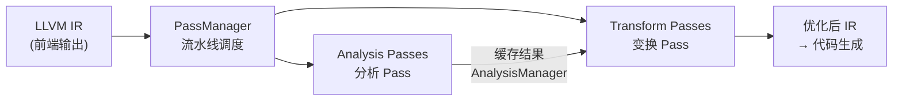
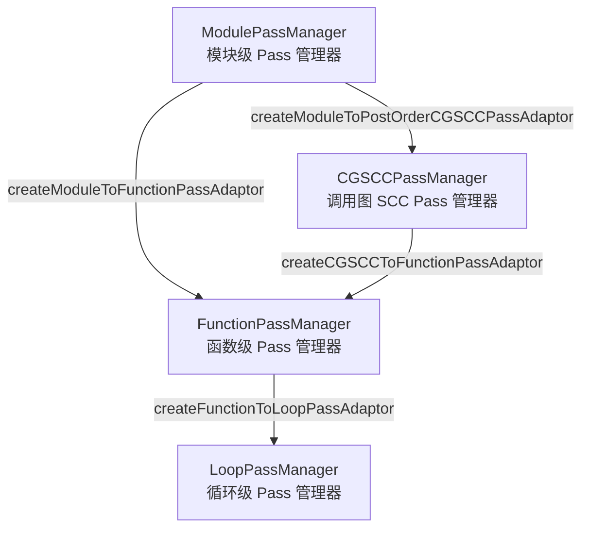
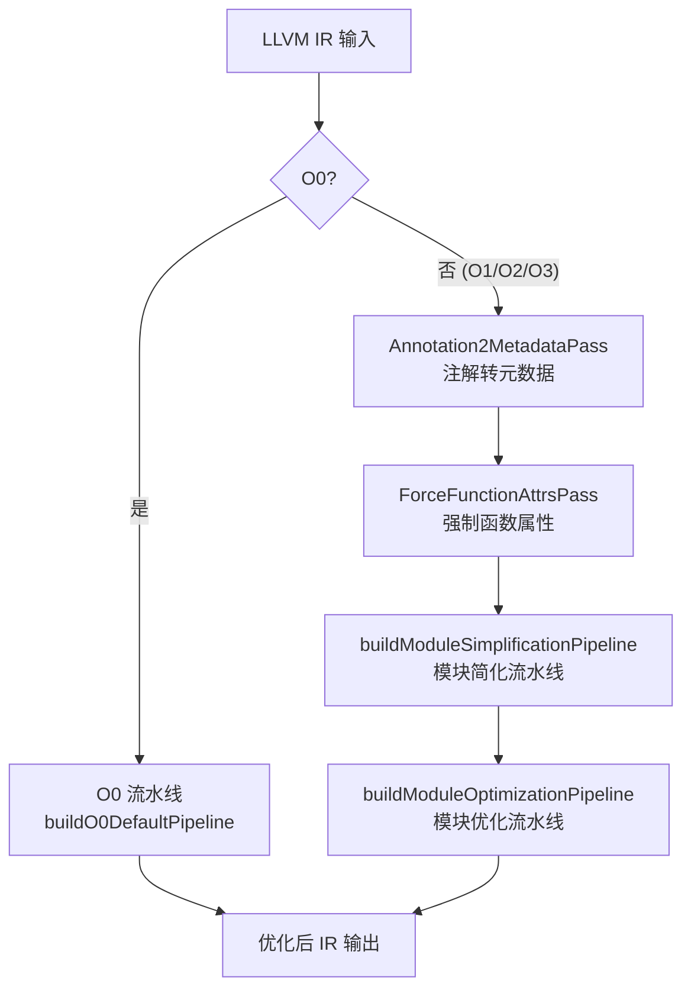
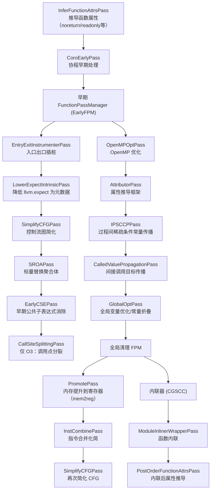
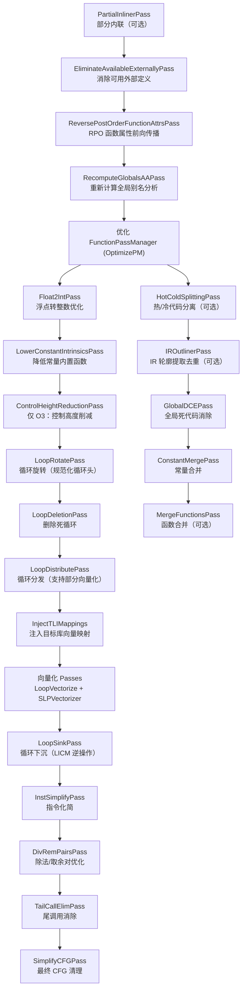

# LLVM Pass 系统执行流程文档

> 来源：`llvm/lib/Passes/PassBuilderPipelines.cpp`、`llvm/include/llvm/IR/PassManager.h`、`llvm/lib/Passes/PassRegistry.def`

---

## 目录

1. [Pass 系统概述](#1-pass-系统概述)
2. [新旧 Pass Manager 对比](#2-新旧-pass-manager-对比)
3. [Pass 层次结构](#3-pass-层次结构)
4. [PassManager 核心机制](#4-passmanager-核心机制)
5. [优化流水线总览](#5-优化流水线总览)
6. [O0 流水线](#6-o0-流水线)
7. [O1-O3 模块简化流水线](#7-o1-o3-模块简化流水线)
8. [O1-O3 模块优化流水线](#8-o1-o3-模块优化流水线)
9. [各类 Pass 详解](#9-各类-pass-详解)
10. [扩展点（Extension Points）](#10-扩展点extension-points)

---

## 1. Pass 系统概述

LLVM Pass 是对 IR 进行分析或变换的基本执行单元。整个编译优化过程由一系列 Pass 按顺序组成流水线执行。



**两类 Pass：**
- **Analysis Pass**：只读 IR，计算并缓存分析结果（别名分析、支配树、循环信息等）
- **Transform Pass**：读写 IR，执行实际优化变换

---

## 2. 新旧 Pass Manager 对比

| 特性 | 旧 Pass Manager (Legacy PM) | 新 Pass Manager (NPM，默认) |
|------|-----------------------------|-----------------------------|
| 基类 | `Pass` / `ModulePass` / `FunctionPass` | 无基类，基于模板概念 |
| 多态方式 | 虚函数继承 | 模板 + 类型擦除 |
| 分析依赖声明 | `getAnalysisUsage()` + `getAnalysis<T>()` | `AnalysisManager::getResult<T>()` |
| Pass 注册 | `INITIALIZE_PASS` 宏 | `PassRegistry.def` |
| 流水线构建 | 手动 `addPass()` | `PassBuilder` 统一构建 |
| 分析缓存失效 | 手动声明 `setPreserves*` | 自动追踪，按需失效 |
| 状态 | 已弃用（LLVM 14+） | 默认使用 |

---

## 3. Pass 层次结构



**各层级说明：**

| 层级 | 操作单元 | 典型 Pass |
|------|----------|-----------|
| `ModulePassManager` | 整个模块 | GlobalOpt、GlobalDCE、Inliner |
| `CGSCCPassManager` | 调用图强连通分量 | CoroSplit、函数属性推导 |
| `FunctionPassManager` | 单个函数 | InstCombine、SROA、GVN |
| `LoopPassManager` | 单个循环 | LICM、LoopUnroll、IndVarSimplify |

---

## 4. PassManager 核心机制

### 4.1 AnalysisManager

分析结果缓存系统，避免重复计算：

```
Pass A 请求 DominatorTree
  → AnalysisManager 检查缓存
    → 命中：直接返回
    → 未命中：运行 DominatorTreeAnalysis，缓存结果，返回
```

当变换 Pass 修改 IR 后，相关分析结果自动失效。

### 4.2 适配器（Adaptor）

用于在不同层级间传递 Pass：

| 适配器 | 作用 |
|--------|------|
| `createModuleToFunctionPassAdaptor` | 将 FunctionPassManager 嵌入 ModulePassManager，对每个函数运行 |
| `createModuleToPostOrderCGSCCPassAdaptor` | 将 CGSCC Pass 嵌入模块，按后序遍历调用图 SCC |
| `createCGSCCToFunctionPassAdaptor` | 将函数 Pass 嵌入 CGSCC Pass |
| `createFunctionToLoopPassAdaptor` | 将循环 Pass 嵌入函数 Pass，从内层到外层遍历循环 |

### 4.3 优化级别

定义于 `llvm/include/llvm/Passes/OptimizationLevel.h`：

| 级别 | 说明 |
|------|------|
| `O0` | 禁用大部分优化，仅执行 `always_inline` |
| `O1` | 快速优化，保持可调试性 |
| `O2` | 平衡编译时间与执行性能（默认） |
| `O3` | 激进优化，包含向量化、循环展开等 |
| `Os` | 优化代码大小 |
| `Oz` | 极致代码大小优化 |

---

## 5. 优化流水线总览



---

## 6. O0 流水线

**函数：** `PassBuilder::buildO0DefaultPipeline()`
**文件：** `lib/Passes/PassBuilderPipelines.cpp:2201`

O0 是最小化流水线，目标是保持调试信息完整，几乎不做优化。

| 顺序 | Pass | 说明 |
|------|------|------|
| 1 | `SampleProfileProbePass` | 仅在启用 PGO 伪探针时运行 |
| 2 | `PGOInstrumentationGen/Use` | 仅在启用 PGO 插桩时运行 |
| 3 | `EntryExitInstrumenterPass` | 函数入口/出口插桩（内联前） |
| 4 | `SampleProfileLoaderPass` | 仅在启用 Sample PGO 时运行 |
| 5 | **`AlwaysInlinerPass`** | **核心**：仅内联标记了 `always_inline` 的函数，不插入 lifetime intrinsic |
| 6 | `MergeFunctionsPass` | 可选：合并相同函数体 |
| 7 | `LowerMatrixIntrinsicsPass` | 可选：降低矩阵内置函数 |

---

## 7. O1-O3 模块简化流水线

**函数：** `PassBuilder::buildModuleSimplificationPipeline()`
**文件：** `lib/Passes/PassBuilderPipelines.cpp:1070`

目标：清理前端输出，为后续优化建立干净的 IR 基础。



### 关键 Pass 说明

| Pass | 作用 |
|------|------|
| `InferFunctionAttrsPass` | 从系统库知识推导函数属性，如 `malloc` 返回 nonnull |
| `SROAPass` | 将结构体/数组分解为独立标量，消除不必要的内存访问 |
| `EarlyCSEPass` | 消除基本块内的重复计算 |
| `IPSCCPPass` | 跨函数的常量传播，Os/Oz 禁用函数特化 |
| `GlobalOptPass` | 将全局变量折叠为常量，消除未使用的全局变量 |
| `PromotePass` | mem2reg：将 alloca 提升为 SSA 寄存器值 |
| `InstCombinePass` | 代数化简、强度削减、冗余指令消除 |
| `ModuleInlinerWrapperPass` | 基于代价模型的函数内联 |


---

## 8. O1-O3 模块优化流水线

**函数：** `PassBuilder::buildModuleOptimizationPipeline()`
**文件：** `lib/Passes/PassBuilderPipelines.cpp:1445`

目标：在简化后的 IR 上执行深度优化，包括向量化、循环优化等。



### 关键 Pass 说明

| Pass | 作用 |
|------|------|
| `Float2IntPass` | 将浮点运算转换为整数运算（当值域允许时） |
| `LoopRotatePass` | 将 while 循环转为 do-while 形式，暴露更多优化机会 |
| `LoopDistributePass` | 将有依赖的循环拆分为多个独立循环，支持部分向量化 |
| `LoopVectorizePass` | 自动循环向量化（SIMD），O2/O3 启用 |
| `SLPVectorizerPass` | 超字级并行向量化，将相邻标量操作合并为向量操作 |
| `LoopSinkPass` | 将 LICM 提升的指令下沉回循环，作为规范化 |
| `TailCallElimPass` | 将尾调用转换为跳转，消除栈帧增长 |
| `HotColdSplittingPass` | 将冷代码路径提取为独立函数，改善指令缓存 |
| `GlobalDCEPass` | 消除未被引用的全局变量和函数 |
| `ConstantMergePass` | 合并内容相同的常量，减少代码大小 |

---

## 9. 各类 Pass 详解

### 9.1 标量优化 Pass（Scalar Transforms）

位于 `llvm/lib/Transforms/Scalar/`，在 FunctionPassManager 中运行。

| Pass | 文件 | 说明 |
|------|------|------|
| `ADCE` | `ADCE.cpp` | 激进死代码消除，基于可达性分析 |
| `BDCE` | `BDCE.cpp` | 位级死代码消除，消除未使用的比特位 |
| `CorrelatedValuePropagation` | `CorrelatedValuePropagation.cpp` | 利用条件分支信息传播值范围 |
| `DCE` | `DCE.cpp` | 基础死代码消除 |
| `DeadStoreElimination` | `DeadStoreElimination.cpp` | 消除被后续写覆盖的无效存储 |
| `EarlyCSE` | `EarlyCSE.cpp` | 早期公共子表达式消除（基于哈希） |
| `GVN` | `GVN.cpp` | 全局值编号，消除冗余计算和加载 |
| `IndVarSimplify` | `IndVarSimplify.cpp` | 归纳变量化简，规范化循环计数器 |
| `JumpThreading` | `JumpThreading.cpp` | 跳转线程化，消除冗余条件分支 |
| `LICM` | `LICM.cpp` | 循环不变代码外提 |
| `LoopUnroll` | `LoopUnroll.cpp` | 循环展开，减少分支开销 |
| `LoopUnrollAndJam` | `LoopUnrollAndJam.cpp` | 循环展开并合并，改善缓存局部性 |
| `MemCpyOpt` | `MemCpyOpt.cpp` | 内存拷贝优化，合并/消除 memcpy |
| `MergedLoadStoreMotion` | `MergedLoadStoreMotion.cpp` | 合并菱形 CFG 中的加载/存储 |
| `NewGVN` | `NewGVN.cpp` | 新版全局值编号（基于 RPO） |
| `Reassociate` | `Reassociate.cpp` | 重新关联表达式，暴露常量折叠机会 |
| `SCCP` | `SCCP.cpp` | 稀疏条件常量传播 |
| `SROA` | `SROA.cpp` | 标量替换聚合体，消除结构体内存访问 |
| `SimplifyCFG` | `SimplifyCFGPass.cpp` | 控制流图简化（合并基本块、消除死分支） |
| `TailCallElim` | `TailCallElim.cpp` | 尾调用消除 |

### 9.2 过程间优化 Pass（IPO Transforms）

位于 `llvm/lib/Transforms/IPO/`，在 ModulePassManager 或 CGSCCPassManager 中运行。

| Pass | 文件 | 说明 |
|------|------|------|
| `AlwaysInliner` | `AlwaysInliner.cpp` | 强制内联 `always_inline` 标记的函数 |
| `ArgumentPromotion` | `ArgumentPromotion.cpp` | 将指针参数提升为值传递，消除间接访问 |
| `Attributor` | `Attributor.cpp` | 大型属性推导框架，推导 nonnull/readonly 等 |
| `CalledValuePropagation` | `CalledValuePropagation.cpp` | 传播间接调用的可能目标集合 |
| `ConstantMerge` | `ConstantMerge.cpp` | 合并相同内容的全局常量 |
| `DeadArgumentElimination` | `DeadArgumentElimination.cpp` | 消除未使用的函数参数和返回值 |
| `FunctionAttrs` | `FunctionAttrs.cpp` | 推导函数属性（norecurse/readonly 等） |
| `GlobalDCE` | `GlobalDCE.cpp` | 消除未引用的全局变量和函数 |
| `GlobalOpt` | `GlobalOpt.cpp` | 全局变量优化（常量折叠、内部化） |
| `Inliner` | `Inliner.cpp` | 基于代价模型的函数内联 |
| `IPConstantPropagation` | `SCCP.cpp` | 过程间常量传播 |
| `MergeFunctions` | `MergeFunctions.cpp` | 合并具有相同语义的函数 |
| `OpenMPOpt` | `OpenMPOpt.cpp` | OpenMP 运行时调用优化 |
| `PartialInlining` | `PartialInlining.cpp` | 部分内联（仅内联函数的热路径） |
| `WholeProgramDevirt` | `WholeProgramDevirt.cpp` | 全程序虚函数去虚化 |

### 9.3 向量化 Pass（Vectorize Transforms）

| Pass | 文件 | 说明 |
|------|------|------|
| `LoopVectorize` | `LoopVectorize.cpp` | 自动循环向量化，生成 SIMD 指令 |
| `SLPVectorizer` | `SLPVectorizer.cpp` | 超字级并行向量化，合并相邻标量操作 |
| `VectorCombine` | `VectorCombine.cpp` | 向量指令合并与化简 |
| `LoadStoreVectorizer` | `LoadStoreVectorizer.cpp` | 合并相邻的加载/存储为向量操作 |

### 9.4 协程 Pass（Coroutine Transforms）

| Pass | 顺序 | 说明 |
|------|------|------|
| `CoroEarlyPass` | 简化流水线最前 | 早期协程处理，标记协程函数 |
| `CoroSplitPass` | CGSCC 阶段 | 将协程函数分割为状态机 |
| `CoroElidePass` | 函数级 | 消除不必要的协程帧堆分配 |
| `CoroCleanupPass` | 模块级最后 | 清理协程相关的临时 IR |

### 9.5 分析 Pass（Analysis）

| 分析 | 说明 |
|------|------|
| `DominatorTreeAnalysis` | 支配树，用于 SSA 构造和循环识别 |
| `LoopAnalysis` | 循环信息，识别自然循环结构 |
| `ScalarEvolutionAnalysis` | 标量演化，分析循环归纳变量的值域 |
| `AliasAnalysis` | 别名分析，判断两个指针是否可能指向同一内存 |
| `BasicAliasAnalysis` | 基础别名分析（基于类型和偏移） |
| `GlobalsAA` | 全局变量别名分析 |
| `MemorySSA` | 内存 SSA，为内存操作建立 def-use 链 |
| `BlockFrequencyAnalysis` | 基本块执行频率估计（用于 PGO） |
| `BranchProbabilityAnalysis` | 分支概率分析 |
| `CallGraphAnalysis` | 调用图构建 |
| `LazyCallGraphAnalysis` | 懒惰调用图（NPM 使用） |
| `ProfileSummaryAnalysis` | PGO profile 摘要信息 |

---

## 10. 扩展点（Extension Points）

PassBuilder 提供扩展点，允许目标后端或插件在特定位置插入自定义 Pass：

| 扩展点 | 触发时机 |
|--------|----------|
| `PipelineStartEP` | 流水线最开始 |
| `PipelineEarlySimplificationEP` | 早期简化阶段 |
| `PeepholeEP` | 窥孔优化阶段（每次 InstCombine 后） |
| `VectorizerStartEP` | 向量化开始前 |
| `VectorizerEndEP` | 向量化结束后 |
| `OptimizerEarlyEP` | 主优化流水线开始 |
| `OptimizerLastEP` | 主优化流水线结束 |
| `CGSCCOptimizerLateEP` | CGSCC 优化后期 |
| `LateLoopOptimizationsEP` | 循环优化后期 |
| `LoopOptimizerEndEP` | 循环优化结束 |
| `ScalarOptimizerLateEP` | 标量优化后期 |

---

## 附：Pass 注册宏速查（PassRegistry.def）

| 宏 | 用途 |
|----|------|
| `MODULE_ANALYSIS(name, pass)` | 注册模块级分析 Pass |
| `MODULE_PASS(name, pass)` | 注册模块级变换 Pass |
| `FUNCTION_ANALYSIS(name, pass)` | 注册函数级分析 Pass |
| `FUNCTION_PASS(name, pass)` | 注册函数级变换 Pass |
| `LOOP_ANALYSIS(name, pass)` | 注册循环级分析 Pass |
| `LOOP_PASS(name, pass)` | 注册循环级变换 Pass |
| `CGSCC_ANALYSIS(name, pass)` | 注册 CGSCC 级分析 Pass |
| `CGSCC_PASS(name, pass)` | 注册 CGSCC 级变换 Pass |

注册后可通过 `opt -passes="pass-name"` 命令行直接调用对应 Pass。
