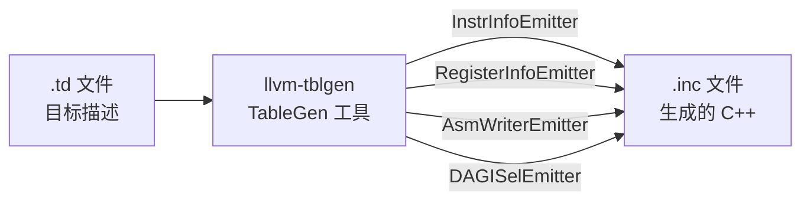
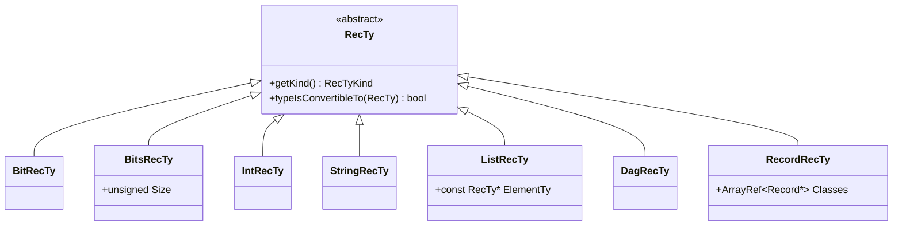
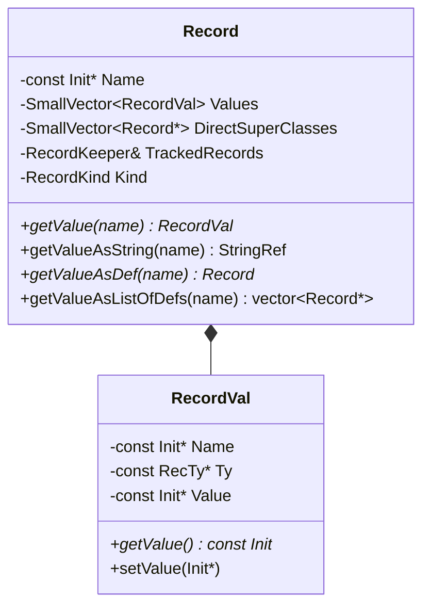
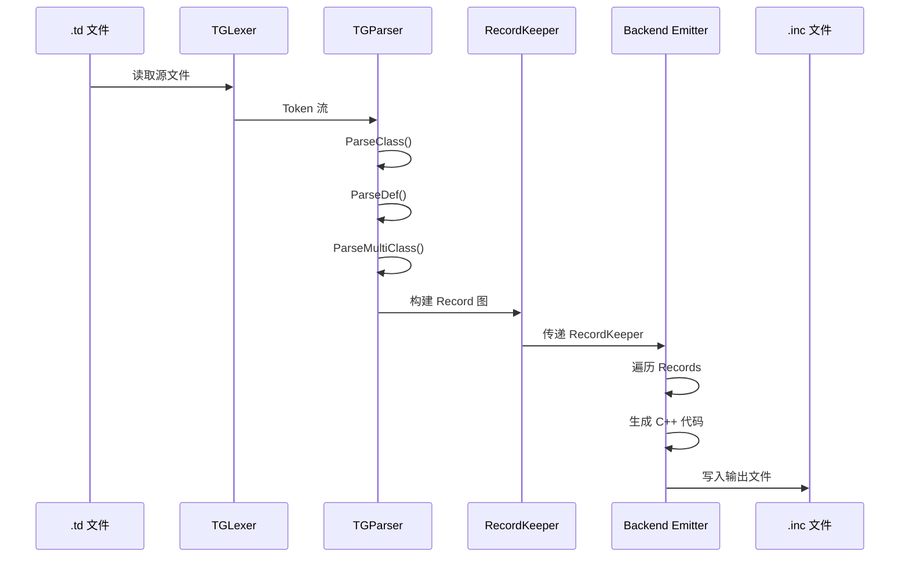

# LLVM TableGen 系统架构文档

> 来源：`llvm/include/llvm/TableGen/`、`llvm/lib/TableGen/`、`llvm/utils/TableGen/`

---

## 目录

1. [TableGen 概述](#1-tablegen-概述)
2. [类型系统](#2-类型系统)
3. [值表示系统（Init 层次结构）](#3-值表示系统init-层次结构)
4. [Record 和 RecordKeeper](#4-record-和-recordkeeper)
5. [TableGen 语法](#5-tablegen-语法)
6. [解析流程](#6-解析流程)
7. [后端生成器系统](#7-后端生成器系统)
8. [X86 后端示例](#8-x86-后端示例)
9. [设计模式](#9-设计模式)

---

## 1. TableGen 概述

TableGen 是 LLVM 的领域特定语言（DSL），用于从 `.td` 文件生成 C++ 代码。主要应用于：
- 目标架构描述（指令集、寄存器、调度）
- 指令选择器生成
- 汇编器/反汇编器生成
- 调用约定定义



**核心库统计：**
- 核心头文件：7 个，约 3,000 行
- 核心实现：5 个，约 10,652 行
- 后端代码：约 48,295 行
- X86 后端描述：77,286 行 TableGen 代码

---

## 2. 类型系统

TableGen 支持 7 种基础类型，定义于 `Record.h`。



| 类型 | 语法 | 说明 | 示例 |
|------|------|------|------|
| `bit` | `bit` | 单个位 | `bit hasREX_W = 1;` |
| `bits<n>` | `bits<8>` | 固定位数 | `bits<8> Opcode = 0x90;` |
| `int` | `int` | 整数 | `int Size = 32;` |
| `string` | `string` | 字符串 | `string Name = "ADD";` |
| `list<T>` | `list<Register>` | 列表 | `list<Register> Regs = [EAX, EBX];` |
| `dag` | `dag` | DAG 节点 | `dag OutOps = (outs GR32:$dst);` |
| `[classname]` | `Register` | Record 类型 | `Register BaseReg = EAX;` |

---

## 3. 值表示系统（Init 层次结构）

所有值在 TableGen 中表示为 `Init` 对象，形成复杂的类型层次结构。

### 3.1 Init 类型枚举

```cpp
enum InitKind : uint8_t {
  IK_BitInit,          // 位值: 0, 1
  IK_BitsInit,         // 位集合: {1, 0, 1, 1}
  IK_IntInit,          // 整数值: 42
  IK_StringInit,       // 字符串值: "hello"
  IK_ListInit,         // 列表值: [1, 2, 3]
  IK_DagInit,          // DAG 节点: (add GR32:$src1, GR32:$src2)
  IK_DefInit,          // 定义引用: EAX
  IK_FieldInit,        // 字段访问: Inst.Opcode
  IK_VarInit,          // 变量引用: $src
  IK_UnOpInit,         // 一元操作: !cast<Register>(x)
  IK_BinOpInit,        // 二元操作: !add(x, y)
  IK_TernOpInit,       // 三元操作: !if(cond, x, y)
  IK_CondOpInit,       // 条件操作: !cond(...)
  IK_FoldOpInit,       // 折叠操作: !foldl(...)
  // ... 等
};
```

### 3.2 操作符系统

#### 一元操作符（UnOpInit）

| 操作符 | 语法 | 说明 |
|--------|------|------|
| `!cast<T>` | `!cast<Register>(x)` | 类型转换 |
| `!head` | `!head(list)` | 列表首元素 |
| `!tail` | `!tail(list)` | 列表尾部 |
| `!size` | `!size(list)` | 列表大小 |
| `!empty` | `!empty(list)` | 是否为空 |
| `!not` | `!not(x)` | 逻辑非 |
| `!tolower` | `!tolower(str)` | 转小写 |
| `!toupper` | `!toupper(str)` | 转大写 |
| `!log2` | `!log2(x)` | 对数 |
| `!getdagop` | `!getdagop(dag)` | 获取 DAG 操作符 |

#### 二元操作符（BinOpInit）

| 操作符 | 语法 | 说明 |
|--------|------|------|
| `!add` / `!sub` / `!mul` / `!div` | `!add(x, y)` | 算术运算 |
| `!and` / `!or` / `!xor` | `!and(x, y)` | 位运算 |
| `!shl` / `!sra` / `!srl` | `!shl(x, 2)` | 移位运算 |
| `!eq` / `!ne` / `!lt` / `!le` / `!gt` / `!ge` | `!eq(x, y)` | 比较运算 |
| `!listconcat` | `!listconcat(l1, l2)` | 列表连接 |
| `!strconcat` | `!strconcat(s1, s2)` | 字符串连接 |
| `!listelem` | `!listelem(list, i)` | 列表元素访问 |
| `!getdagarg` | `!getdagarg(dag, i)` | 获取 DAG 参数 |
| `!setdagop` | `!setdagop(dag, op)` | 设置 DAG 操作符 |

#### 三元操作符（TernOpInit）

| 操作符 | 语法 | 说明 |
|--------|------|------|
| `!if` | `!if(cond, then, else)` | 条件表达式 |
| `!foreach` | `!foreach(var, list, body)` | 遍历列表 |
| `!filter` | `!filter(var, list, pred)` | 过滤列表 |
| `!subst` | `!subst(old, new, str)` | 字符串替换 |
| `!substr` | `!substr(str, start, len)` | 子串提取 |
| `!find` | `!find(str, pattern)` | 查找子串 |
| `!dag` | `!dag(op, args, names)` | 构造 DAG |
| `!range` | `!range(start, end, step)` | 生成范围 |

---

## 4. Record 和 RecordKeeper

### 4.1 Record 类结构



**Record 类型：**
- `RK_Def`：普通定义（`def`）
- `RK_AnonymousDef`：匿名定义
- `RK_Class`：类定义（`class`）
- `RK_MultiClass`：多类定义（`multiclass`）

### 4.2 RecordKeeper 结构

```cpp
class RecordKeeper {
  RecordMap Classes;    // 所有 class 定义
  RecordMap Defs;       // 所有 def 定义
  GlobalMap Globals;    // 全局变量

  // 核心查询方法
  const RecordMap &getClasses() const;
  const RecordMap &getDefs() const;
  Record *getClass(StringRef Name) const;
  Record *getDef(StringRef Name) const;

  // 派生查询
  std::vector<const Record *> getAllDerivedDefinitions(StringRef ClassName);
  std::vector<const Record *> getAllDerivedDefinitionsIfDefined(StringRef ClassName);
};
```

### 4.3 对象池机制

RecordKeeper 内部使用 `RecordKeeperImpl` 管理所有 Init 对象的内存：

```cpp
struct RecordKeeperImpl {
  BumpPtrAllocator Allocator;           // 内存分配器

  // 共享类型实例
  BitRecTy SharedBitRecTy;
  IntRecTy SharedIntRecTy;
  StringRecTy SharedStringRecTy;
  DagRecTy SharedDagRecTy;

  // Init 对象池（享元模式）
  FoldingSet<BitsInit> TheBitsInitPool;
  std::map<int64_t, IntInit *> TheIntInitPool;
  StringMap<const StringInit *> StringInitStringPool;
  FoldingSet<ListInit> TheListInitPool;
  FoldingSet<DagInit> TheDagInitPool;
  // ... 更多对象池
};
```

---

## 5. TableGen 语法

### 5.1 基本语法元素

| 关键字 | 语法 | 说明 |
|--------|------|------|
| `class` | `class ClassName<params> : ParentClass { ... }` | 定义类 |
| `def` | `def InstanceName : ClassName<args> { ... }` | 定义实例 |
| `multiclass` | `multiclass Name<params> { ... }` | 定义多类 |
| `defm` | `defm Prefix : MultiClassName<args>;` | 实例化多类 |
| `let` | `let Field = Value in { ... }` | 设置字段值 |
| `foreach` | `foreach var = list in { ... }` | 循环 |
| `defvar` | `defvar name = value;` | 定义局部变量 |
| `defset` | `defset type name = { ... }` | 定义集合 |
| `assert` | `assert condition, "message";` | 断言 |

### 5.2 class 定义示例

```tablegen
// 定义寄存器类
class Register<string n> {
  string Name = n;
  string Namespace = "";
  bits<16> HWEncoding = 0;
  list<Register> SubRegs = [];
}

// 定义 X86 寄存器类
class X86Reg<string n, bits<16> Enc> : Register<n> {
  let Namespace = "X86";
  let HWEncoding = Enc;
}

// 定义具体寄存器
def EAX : X86Reg<"eax", 0>;
def EBX : X86Reg<"ebx", 3>;
def ECX : X86Reg<"ecx", 1>;
def EDX : X86Reg<"edx", 2>;
```

### 5.3 multiclass 和 defm 示例

```tablegen
// 定义多类：为不同位宽生成指令
multiclass BinOp<bits<8> opc, string mnemonic> {
  def 8rr  : Inst<opc, (outs GR8:$dst),  (ins GR8:$src1,  GR8:$src2),
                  !strconcat(mnemonic, "b\t{$src2, $dst|$dst, $src2}")>;
  def 16rr : Inst<opc, (outs GR16:$dst), (ins GR16:$src1, GR16:$src2),
                  !strconcat(mnemonic, "w\t{$src2, $dst|$dst, $src2}")>;
  def 32rr : Inst<opc, (outs GR32:$dst), (ins GR32:$src1, GR32:$src2),
                  !strconcat(mnemonic, "l\t{$src2, $dst|$dst, $src2}")>;
  def 64rr : Inst<opc, (outs GR64:$dst), (ins GR64:$src1, GR64:$src2),
                  !strconcat(mnemonic, "q\t{$src2, $dst|$dst, $src2}")>;
}

// 实例化：生成 ADD8rr, ADD16rr, ADD32rr, ADD64rr
defm ADD : BinOp<0x01, "add">;
defm SUB : BinOp<0x29, "sub">;
defm AND : BinOp<0x21, "and">;
```

### 5.4 DAG 语法

DAG（有向无环图）用于表示指令的操作数和模式匹配：

```tablegen
// 指令定义
def ADDrr : Inst<(outs GR32:$dst), (ins GR32:$src1, GR32:$src2),
                 "add\t{$src2, $dst|$dst, $src2}",
                 [(set GR32:$dst, (add GR32:$src1, GR32:$src2))]>;

// DAG 结构解析：
// (outs GR32:$dst)           - 输出操作数：32位通用寄存器 $dst
// (ins GR32:$src1, GR32:$src2) - 输入操作数：两个32位通用寄存器
// [(set ...)]                - 模式匹配：匹配 add 操作
```

---

## 6. 解析流程



### 6.1 主流程

```cpp
// 位置: Main.cpp
int TableGenMain(const char *argv0, TableGenMainFn MainFn) {
  RecordKeeper Records;

  // 1. 词法分析 + 语法分析
  TGParser Parser(SrcMgr, MacroNames, Records);
  if (Parser.ParseFile())
    return 1;

  // 2. 调用后端生成器
  if (MainFn)
    status = MainFn(Out, Records);

  // 3. 写入输出
  OutFile.os() << OutString;
  return 0;
}
```

### 6.2 解析器关键函数

| 函数 | 功能 |
|------|------|
| `ParseFile()` | 解析整个文件 |
| `ParseTopLevelItem()` | 解析顶层项（class/def/multiclass/let/foreach） |
| `ParseClass()` | 解析 class 定义 |
| `ParseDef()` | 解析 def 定义 |
| `ParseDefm()` | 解析 defm（multiclass 实例化） |
| `ParseMultiClass()` | 解析 multiclass 定义 |
| `ParseLet()` | 解析 let 语句 |
| `ParseForeachDeclaration()` | 解析 foreach 循环 |
| `ParseValue()` | 解析值表达式 |
| `ParseSimpleValue()` | 解析简单值（字面量、变量引用） |
| `ParseOperation()` | 解析操作符表达式 |

---

## 7. 后端生成器系统

### 7.1 后端统计

**位置：** `llvm/utils/TableGen/`
**总代码量：** 约 48,295 行

### 7.2 主要后端生成器

| 后端 | 文件 | 功能 | 生成文件 |
|------|------|------|----------|
| InstrInfoEmitter | InstrInfoEmitter.cpp | 指令信息表 | *GenInstrInfo.inc |
| RegisterInfoEmitter | RegisterInfoEmitter.cpp | 寄存器信息 | *GenRegisterInfo.inc |
| DAGISelEmitter | DAGISelEmitter.cpp | DAG 指令选择器 | *GenDAGISel.inc |
| AsmWriterEmitter | AsmWriterEmitter.cpp | 汇编输出器 | *GenAsmWriter.inc |
| AsmMatcherEmitter | AsmMatcherEmitter.cpp | 汇编解析器 | *GenAsmMatcher.inc |
| CodeEmitterGen | CodeEmitterGen.cpp | 机器码发射器 | *GenMCCodeEmitter.inc |
| SubtargetEmitter | SubtargetEmitter.cpp | 子目标信息 | *GenSubtargetInfo.inc |
| CallingConvEmitter | CallingConvEmitter.cpp | 调用约定 | *GenCallingConv.inc |
| DecoderEmitter | DecoderEmitter.cpp | 反汇编器 | *GenDisassemblerTables.inc |
| GlobalISelEmitter | GlobalISelEmitter.cpp | 全局指令选择器 | *GenGlobalISel.inc |
| FastISelEmitter | FastISelEmitter.cpp | 快速指令选择器 | *GenFastISel.inc |

### 7.3 后端接口

```cpp
// 位置: TableGenBackend.h
namespace TableGen::Emitter {
  using FnT = function_ref<void(const RecordKeeper &Records, raw_ostream &OS)>;
}

// 后端注册
static TableGen::Emitter::Opt Emitters[] = {
  {"gen-instr-info", EmitInstrInfo, "Generate instruction info"},
  {"gen-register-info", EmitRegisterInfo, "Generate register info"},
  {"gen-dag-isel", EmitDAGISel, "Generate DAG instruction selector"},
  // ...
};
```

### 7.4 典型后端实现流程

以 RegisterInfoEmitter 为例：

```cpp
void EmitRegisterInfo(const RecordKeeper &RK, raw_ostream &OS) {
  // 1. 获取所有寄存器定义
  std::vector<const Record *> Regs =
      RK.getAllDerivedDefinitions("Register");

  // 2. 生成寄存器枚举
  OS << "enum {\n";
  for (const Record *Reg : Regs) {
    OS << "  " << Reg->getName() << " = "
       << Reg->getValueAsInt("HWEncoding") << ",\n";
  }
  OS << "};\n";

  // 3. 生成寄存器描述表
  OS << "static const MCRegisterDesc RegisterDescriptors[] = {\n";
  for (const Record *Reg : Regs) {
    OS << "  { " << Reg->getValueAsString("Name") << ", "
       << Reg->getValueAsInt("HWEncoding") << " },\n";
  }
  OS << "};\n";
}
```


---

## 8. X86 后端示例

### 8.1 X86 TableGen 文件统计

**位置：** `llvm/lib/Target/X86/`
**总行数：** 77,286 行 TableGen 代码
**文件数：** 60 个 .td 文件

**主要文件：**

| 文件 | 行数 | 功能 |
|------|------|------|
| X86.td | 1,200 | 主描述文件，包含所有子文件 |
| X86RegisterInfo.td | 2,500 | 寄存器定义 |
| X86InstrInfo.td | 1,800 | 指令描述入口 |
| X86InstrFormats.td | 3,200 | 指令格式定义 |
| X86InstrArithmetic.td | 4,500 | 算术指令 |
| X86InstrSSE.td | 12,000 | SSE 指令集 |
| X86InstrAVX512.td | 18,000 | AVX-512 指令集 |
| X86Schedule*.td | 15,000 | 调度模型 |

### 8.2 X86 寄存器定义

```tablegen
// 位置: X86RegisterInfo.td

// 定义 X86 寄存器基类
class X86Reg<string n, bits<16> Enc, list<Register> subregs = []> 
  : Register<n> {
  let Namespace = "X86";
  let HWEncoding = Enc;
  let SubRegs = subregs;
}

// 子寄存器索引
let Namespace = "X86" in {
  def sub_8bit     : SubRegIndex<8>;
  def sub_8bit_hi  : SubRegIndex<8, 8>;
  def sub_16bit    : SubRegIndex<16>;
  def sub_32bit    : SubRegIndex<32>;
  def sub_xmm      : SubRegIndex<128>;
  def sub_ymm      : SubRegIndex<256>;
}

// 8位寄存器
def AL : X86Reg<"al", 0>;
def CL : X86Reg<"cl", 1>;
def DL : X86Reg<"dl", 2>;
def BL : X86Reg<"bl", 3>;

// 16位寄存器（包含8位子寄存器）
let SubRegIndices = [sub_8bit, sub_8bit_hi] in {
  def AX : X86Reg<"ax", 0, [AL, AH]>;
  def CX : X86Reg<"cx", 1, [CL, CH]>;
  def DX : X86Reg<"dx", 2, [DL, DH]>;
  def BX : X86Reg<"bx", 3, [BL, BH]>;
}

// 32位寄存器（包含16位子寄存器）
let SubRegIndices = [sub_16bit] in {
  def EAX : X86Reg<"eax", 0, [AX]>;
  def ECX : X86Reg<"ecx", 1, [CX]>;
  def EDX : X86Reg<"edx", 2, [DX]>;
  def EBX : X86Reg<"ebx", 3, [BX]>;
}

// 64位寄存器（包含32位子寄存器）
let SubRegIndices = [sub_32bit] in {
  def RAX : X86Reg<"rax", 0, [EAX]>;
  def RCX : X86Reg<"rcx", 1, [ECX]>;
  def RDX : X86Reg<"rdx", 2, [EDX]>;
  def RBX : X86Reg<"rbx", 3, [EBX]>;
}

// 寄存器类
def GR8  : RegisterClass<"X86", [i8],  8, (sequence "AL", "CL", "DL", "BL")>;
def GR16 : RegisterClass<"X86", [i16], 16, (sequence "AX", "CX", "DX", "BX")>;
def GR32 : RegisterClass<"X86", [i32], 32, (sequence "EAX", "ECX", "EDX", "EBX")>;
def GR64 : RegisterClass<"X86", [i64], 64, (sequence "RAX", "RCX", "RDX", "RBX")>;
```

### 8.3 X86 指令格式定义

```tablegen
// 位置: X86InstrFormats.td

// 指令格式枚举
class Format<bits<7> val> {
  bits<7> Value = val;
}

def Pseudo        : Format<0>;   // 伪指令
def RawFrm        : Format<1>;   // 原始格式
def AddRegFrm     : Format<2>;   // 操作码 + 寄存器
def MRMDestMem    : Format<24>;  // ModRM，目标为内存
def MRMSrcMem     : Format<25>;  // ModRM，源为内存
def MRMDestReg    : Format<40>;  // ModRM，目标为寄存器
def MRMSrcReg     : Format<41>;  // ModRM，源为寄存器
// ... 共 128 种格式

// X86 指令基类
class X86Inst<bits<8> opcod, Format f, ImmType i, dag outs, dag ins,
              string AsmStr, Domain d = GenericDomain>
  : Instruction {
  let Namespace = "X86";

  bits<8> Opcode = opcod;           // 操作码
  Format Form = f;                   // 指令格式
  ImmType ImmT = i;                  // 立即数类型

  dag OutOperandList = outs;         // 输出操作数
  dag InOperandList = ins;           // 输入操作数
  string AsmString = AsmStr;         // 汇编字符串

  // 编码字段
  bit hasREX_W = 0;                  // REX.W 前缀
  bit hasVEX_4V = 0;                 // VEX.VVVV 字段
  bit hasVEX_L = 0;                  // VEX.L 位
  bit hasEVEX_K = 0;                 // EVEX 掩码寄存器
  bit hasEVEX_Z = 0;                 // EVEX 零掩码
  bit hasEVEX_B = 0;                 // EVEX 广播

  Domain ExeDomain = d;              // 执行域（整数/浮点/向量）

  // 调度信息
  list<SchedReadWrite> SchedRW = [];
}
```

### 8.4 X86 指令定义示例

```tablegen
// 位置: X86InstrArithmetic.td

// ADD 指令 multiclass
multiclass ArithBinOp<bits<8> BaseOpc, string mnemonic, SDNode OpNode> {
  // 8位寄存器-寄存器
  let Defs = [EFLAGS] in
  def 8rr : BinOpRR<BaseOpc, mnemonic, Xi8, OpNode>;

  // 16位寄存器-寄存器
  let Defs = [EFLAGS] in
  def 16rr : BinOpRR<BaseOpc, mnemonic, Xi16, OpNode>, OpSize16;

  // 32位寄存器-寄存器
  let Defs = [EFLAGS] in
  def 32rr : BinOpRR<BaseOpc, mnemonic, Xi32, OpNode>, OpSize32;

  // 64位寄存器-寄存器
  let Defs = [EFLAGS] in
  def 64rr : BinOpRR<BaseOpc, mnemonic, Xi64, OpNode>;

  // 寄存器-内存版本
  let Defs = [EFLAGS], mayLoad = 1 in {
    def 8rm  : BinOpRM<BaseOpc, mnemonic, Xi8, OpNode>;
    def 16rm : BinOpRM<BaseOpc, mnemonic, Xi16, OpNode>, OpSize16;
    def 32rm : BinOpRM<BaseOpc, mnemonic, Xi32, OpNode>, OpSize32;
    def 64rm : BinOpRM<BaseOpc, mnemonic, Xi64, OpNode>;
  }

  // 内存-寄存器版本
  let Defs = [EFLAGS], mayStore = 1 in {
    def 8mr  : BinOpMR<BaseOpc, mnemonic, Xi8, OpNode>;
    def 16mr : BinOpMR<BaseOpc, mnemonic, Xi16, OpNode>, OpSize16;
    def 32mr : BinOpMR<BaseOpc, mnemonic, Xi32, OpNode>, OpSize32;
    def 64mr : BinOpMR<BaseOpc, mnemonic, Xi64, OpNode>;
  }
}

// 实例化 ADD 指令
defm ADD : ArithBinOp<0x00, "add", add>;
// 生成: ADD8rr, ADD16rr, ADD32rr, ADD64rr, ADD8rm, ADD16rm, ...

// 实例化其他算术指令
defm SUB : ArithBinOp<0x28, "sub", sub>;
defm AND : ArithBinOp<0x20, "and", and>;
defm OR  : ArithBinOp<0x08, "or",  or>;
defm XOR : ArithBinOp<0x30, "xor", xor>;
```

### 8.5 X86 模式匹配示例

```tablegen
// 位置: X86InstrInfo.td

// 定义 SDNode（SelectionDAG 节点）
def X86add_flag : SDNode<"X86ISD::ADD", SDTBinaryArithWithFlags,
                         [SDNPCommutative]>;

// 指令定义，包含模式匹配
def ADD32rr : I<0x01, MRMDestReg, (outs GR32:$dst),
                (ins GR32:$src1, GR32:$src2),
                "add{l}\t{$src2, $dst|$dst, $src2}",
                [(set GR32:$dst, EFLAGS, (X86add_flag GR32:$src1, GR32:$src2))]>;

// 模式匹配解析：
// (set GR32:$dst, EFLAGS, (X86add_flag GR32:$src1, GR32:$src2))
// 匹配：dst = src1 + src2，同时设置 EFLAGS

// 复杂模式匹配：内存操作数
def ADD32rm : I<0x03, MRMSrcMem, (outs GR32:$dst),
                (ins GR32:$src1, i32mem:$src2),
                "add{l}\t{$src2, $dst|$dst, $src2}",
                [(set GR32:$dst, EFLAGS,
                      (X86add_flag GR32:$src1, (load addr:$src2)))]>;

// 匹配：dst = src1 + *src2（从内存加载）
```

### 8.6 X86 调度模型示例

```tablegen
// 位置: X86ScheduleBtVer2.td

// 定义处理器模型
def BtVer2Model : SchedMachineModel {
  let IssueWidth = 2;              // 每周期发射2条指令
  let MicroOpBufferSize = 64;      // 微操作缓冲区大小
  let LoadLatency = 5;             // 加载延迟
  let HighLatency = 25;            // 高延迟阈值
  let MispredictPenalty = 14;      // 分支预测失败惩罚
}

// 定义执行单元
def BtVer2FPU0 : ProcResource<1>;  // 浮点单元0
def BtVer2FPU1 : ProcResource<1>;  // 浮点单元1
def BtVer2ALU0 : ProcResource<1>;  // 整数ALU0
def BtVer2ALU1 : ProcResource<1>;  // 整数ALU1

// 定义指令调度
def : WriteRes<WriteALU, [BtVer2ALU0, BtVer2ALU1]> {
  let Latency = 1;                 // 延迟1周期
  let NumMicroOps = 1;             // 1个微操作
}

def : WriteRes<WriteFAdd, [BtVer2FPU0, BtVer2FPU1]> {
  let Latency = 3;                 // 浮点加法延迟3周期
  let NumMicroOps = 1;
}
```

---

## 9. 设计模式

### 9.1 享元模式（Flyweight）

RecordKeeper 使用对象池缓存所有 Init 对象，相同的值共享同一实例：

```cpp
// 所有值为 42 的 IntInit 共享同一对象
IntInit *i1 = IntInit::get(Records, 42);
IntInit *i2 = IntInit::get(Records, 42);
assert(i1 == i2);  // 指针相等

// 所有 "hello" 字符串共享同一对象
StringInit *s1 = StringInit::get(Records, "hello");
StringInit *s2 = StringInit::get(Records, "hello");
assert(s1 == s2);
```

**优势：**
- 大幅减少内存占用
- 加速相等性比较（指针比较）
- 简化内存管理

### 9.2 访问者模式（Visitor）

Init 类型层次结构支持递归遍历和转换：

```cpp
class Init {
  // 解析引用（访问者模式）
  virtual const Init *resolveReferences(Resolver &R) const = 0;

  // 折叠常量表达式
  virtual const Init *Fold(const Record *CurRec) const = 0;

  // 转换为字符串
  virtual std::string getAsString() const = 0;
};

// 示例：BinOpInit 的 resolveReferences
const Init *BinOpInit::resolveReferences(Resolver &R) const {
  const Init *lhs = LHS->resolveReferences(R);  // 递归解析左操作数
  const Init *rhs = RHS->resolveReferences(R);  // 递归解析右操作数
  return BinOpInit::get(getOpcode(), lhs, rhs, getType());
}
```

### 9.3 原型模式（Prototype）

multiclass 作为原型，通过 defm 实例化多个 Record：

```tablegen
// multiclass 是原型
multiclass BinOp<bits<8> opc, string mnemonic> {
  def 8rr  : Inst<...>;
  def 16rr : Inst<...>;
  def 32rr : Inst<...>;
}

// defm 克隆原型，生成多个实例
defm ADD : BinOp<0x01, "add">;  // 生成 ADD8rr, ADD16rr, ADD32rr
defm SUB : BinOp<0x29, "sub">;  // 生成 SUB8rr, SUB16rr, SUB32rr
```

### 9.4 策略模式（Strategy）

后端生成器通过函数指针注册，支持动态选择：

```cpp
// 后端策略接口
using EmitterFn = function_ref<void(const RecordKeeper &, raw_ostream &)>;

// 注册不同策略
static TableGen::Emitter::Opt Emitters[] = {
  {"gen-instr-info", EmitInstrInfo, "Generate instruction info"},
  {"gen-register-info", EmitRegisterInfo, "Generate register info"},
  {"gen-dag-isel", EmitDAGISel, "Generate DAG instruction selector"},
};

// 运行时选择策略
TableGen::Emitter::ApplyCallback(Records, Out);
```

### 9.5 建造者模式（Builder）

DagInit 使用 TrailingObjects 构建复杂的 DAG 结构：

```cpp
class DagInit : public TypedInit,
                private TrailingObjects<DagInit, const Init *, const StringInit *> {
  const Init *Val;              // 操作符
  const StringInit *ValName;    // 操作符名称
  unsigned NumArgs;             // 参数数量

  // 参数和参数名通过 TrailingObjects 存储在对象后面
  // 避免额外的指针间接访问
};

// 构建 DAG
DagInit *dag = DagInit::get(Operator, OperatorName, Args, ArgNames);
```

---

## 10. 总结

LLVM TableGen 是一个功能强大的代码生成系统，核心特性包括：

### 10.1 核心优势

1. **声明式描述**：用高层次的 DSL 描述目标架构，避免手写重复代码
2. **类型安全**：强类型系统确保描述的正确性
3. **可扩展性**：支持 class 继承、multiclass、模板等高级特性
4. **高效实现**：享元模式、对象池、BumpPtrAllocator 优化内存使用
5. **模块化后端**：30+ 个独立的代码生成器，各司其职

### 10.2 应用场景

- **指令集描述**：定义指令格式、操作码、操作数
- **寄存器描述**：定义寄存器层次、寄存器类、调用约定
- **指令选择**：定义 DAG 模式匹配规则
- **汇编器/反汇编器**：生成汇编解析和输出代码
- **调度模型**：定义处理器流水线和指令延迟

### 10.3 统计数据

| 项目 | 数量 |
|------|------|
| 核心库代码 | 10,652 行 |
| 后端代码 | 48,295 行 |
| X86 后端描述 | 77,286 行 |
| 基础类型 | 7 种 |
| Init 类型 | 20+ 种 |
| 操作符 | 50+ 个 |
| 后端生成器 | 30+ 个 |

### 10.4 关键文件路径

**核心库：**
- `llvm/include/llvm/TableGen/Record.h` - 类型和 Record 定义
- `llvm/lib/TableGen/TGParser.cpp` - 语法解析器
- `llvm/lib/TableGen/Record.cpp` - Record 实现

**后端工具：**
- `llvm/utils/TableGen/` - 所有后端生成器
- `llvm/utils/TableGen/TableGen.cpp` - 主程序入口

**X86 示例：**
- `llvm/lib/Target/X86/X86.td` - X86 主描述文件
- `llvm/lib/Target/X86/X86RegisterInfo.td` - 寄存器定义
- `llvm/lib/Target/X86/X86InstrInfo.td` - 指令定义

TableGen 通过精心设计的类型系统、强大的操作符和灵活的后端机制，成为 LLVM 后端开发的基石，极大地提高了代码质量和开发效率。
