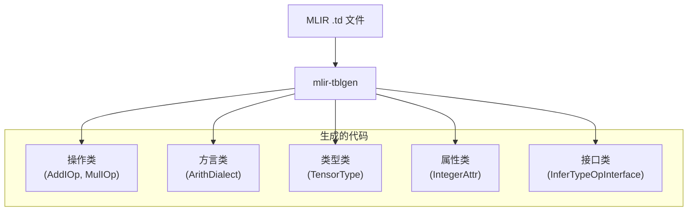

# MLIR TableGen 系统架构文档

> 来源：`mlir/include/mlir/IR/`、`mlir/tools/mlir-tblgen/`

---

## 目录

1. [MLIR TableGen 概述](#1-mlir-tablegen-概述)
2. [核心基础类](#2-核心基础类)
3. [Dialect 系统](#3-dialect-系统)
4. [Op 定义系统](#4-op-定义系统)
5. [类型和属性系统](#5-类型和属性系统)
6. [接口系统](#6-接口系统)
7. [Trait 系统](#7-trait-系统)
8. [声明式汇编格式](#8-声明式汇编格式)
9. [DRR 模式重写](#9-drr-模式重写)
10. [mlir-tblgen 后端](#10-mlir-tblgen-后端)

---

## 1. MLIR TableGen 概述

MLIR TableGen 是 LLVM TableGen 在 IR 抽象层次的应用，用于定义和生成 MLIR 方言、操作、类型、属性和接口。

### 1.1 核心特性



**关键特性：**
- **方言系统**：支持多方言共存（Arith、Func、SCF 等）
- **可扩展类型**：通过 TypeDef 自定义类型
- **可扩展属性**：通过 AttrDef 自定义属性
- **接口系统**：OpInterface/TypeInterface/AttrInterface 提供多态
- **声明式汇编**：assemblyFormat 自动生成解析器/打印器
- **模式重写**：DRR 声明式重写规则

### 1.2 文件组织

```
mlir/include/mlir/IR/
├── OpBase.td              # Op 定义基类
├── DialectBase.td         # Dialect 定义
├── AttrTypeBase.td        # 属性和类型定义
├── Interfaces.td          # 接口系统
├── Traits.td              # Trait 系统
├── OpAsmInterface.td      # 汇编接口
├── RegionKindInterface.td # 区域接口
└── PatternBase.td         # 模式重写基类

mlir/include/mlir/Dialect/
├── Arith/IR/              # 算术方言
│   ├── ArithBase.td
│   └── ArithOps.td
├── Func/IR/               # 函数方言
│   └── FuncOps.td
└── SCF/IR/                # 结构化控制流方言
    └── SCFOps.td
```

---

## 2. 核心基础类

### 2.1 Dialect 定义（DialectBase.td）

**文件路径：** `mlir/include/mlir/IR/DialectBase.td`

```tablegen
class Dialect {
  string name = ?;                          // Dialect 名称
  string summary = ?;                       // 简短摘要
  string description = ?;                   // 详细描述
  list<string> dependentDialects = [];      // 依赖的其他 Dialect
  string cppNamespace = name;               // C++ 命名空间
  
  // 功能开关
  bit hasConstantMaterializer = 0;          // 是否有常量物化器
  bit hasOperationAttrVerify = 0;           // 是否验证操作属性
  bit hasRegionArgAttrVerify = 0;           // 是否验证区域参数属性
  bit useDefaultAttributePrinterParser = 0; // 使用默认属性打印/解析器
  bit useDefaultTypePrinterParser = 0;      // 使用默认类型打印/解析器
  bit hasCanonicalizer = 0;                 // 是否有规范化器
  bit isExtensible = 0;                     // 是否可扩展
  
  code extraClassDeclaration = "";          // 额外的类声明
}
```

**示例：**
```tablegen
def Arith_Dialect : Dialect {
  let name = "arith";
  let cppNamespace = "::mlir::arith";
  let hasConstantMaterializer = 1;
  let useDefaultAttributePrinterParser = 1;
  let description = [{
    The arith dialect holds basic integer and floating point
    mathematical operations.
  }];
}
```

### 2.2 Op 定义基类（OpBase.td）

**文件路径：** `mlir/include/mlir/IR/OpBase.td`

```tablegen
class Op<Dialect dialect, string mnemonic, list<Trait> props = []> {
  Dialect opDialect = dialect;
  string opName = mnemonic;
  
  // 操作数和结果
  dag arguments = (ins);
  dag results = (outs);
  
  // 区域和后继块
  dag regions = (region);
  dag successors = (successor);
  
  // 汇编格式
  string assemblyFormat = "";
  
  // 文档
  string summary = "";
  code description = "";
  
  // 生成选项
  bit hasVerifier = 0;
  bit hasFolder = 0;
  bit hasCanonicalizer = 0;
  bit hasRegionVerifier = 0;
  
  // Trait 列表
  list<Trait> traits = props;
  
  // 额外声明
  code extraClassDeclaration = "";
}
```

### 2.3 Trait 系统（Traits.td）

**预定义 Trait：**

| Trait | 说明 |
|-------|------|
| `Commutative` | 可交换（X op Y == Y op X） |
| `Idempotent` | 幂等（op op X == op X） |
| `Involution` | 对合（op op X == X） |
| `NoMemoryEffect` | 无内存副作用 |
| `SameOperandsAndResultType` | 操作数和结果类型相同 |
| `SameOperandsShape` | 操作数形状相同 |
| `Terminator` | 终结符（块的最后一条指令） |
| `IsolatedFromAbove` | 与外部隔离 |
| `AutomaticAllocationScope` | 自动分配作用域 |

---

## 3. Dialect 系统

### 3.1 Dialect 定义示例

```tablegen
// Arith Dialect
def Arith_Dialect : Dialect {
  let name = "arith";
  let cppNamespace = "::mlir::arith";
  let hasConstantMaterializer = 1;
  let useDefaultAttributePrinterParser = 1;
}

// Func Dialect
def Func_Dialect : Dialect {
  let name = "func";
  let cppNamespace = "::mlir::func";
  let hasConstantMaterializer = 1;
}

// SCF Dialect
def SCF_Dialect : Dialect {
  let name = "scf";
  let cppNamespace = "::mlir::scf";
  let dependentDialects = ["arith::ArithDialect"];
}
```

### 3.2 生成的 Dialect 类

```cpp
// ArithDialect.h.inc
class ArithDialect : public ::mlir::Dialect {
public:
  explicit ArithDialect(::mlir::MLIRContext *context);
  
  static constexpr ::llvm::StringLiteral getDialectNamespace() {
    return ::llvm::StringLiteral("arith");
  }
  
  // 常量物化器
  ::mlir::Operation *materializeConstant(::mlir::OpBuilder &builder,
                                          ::mlir::Attribute value,
                                          ::mlir::Type type,
                                          ::mlir::Location loc) override;
  
  // 属性打印/解析
  ::mlir::Attribute parseAttribute(::mlir::DialectAsmParser &parser,
                                    ::mlir::Type type) const override;
  void printAttribute(::mlir::Attribute attr,
                      ::mlir::DialectAsmPrinter &os) const override;
};
```

---

## 4. Op 定义系统

### 4.1 Op 基类定义

```tablegen
// Arith Op 基类
class Arith_Op<string mnemonic, list<Trait> traits = []> :
    Op<Arith_Dialect, mnemonic,
       traits # [DeclareOpInterfaceMethods<VectorUnrollOpInterface>,
                 NoMemoryEffect] # ElementwiseMappable.traits>;

// 二元操作基类
class Arith_BinaryOp<string mnemonic, list<Trait> traits = []> :
    Arith_Op<mnemonic, traits # [SameOperandsAndResultType]> {
  let assemblyFormat = "$lhs `,` $rhs attr-dict `:` type($result)";
}

// 整数二元操作
class Arith_IntBinaryOp<string mnemonic, list<Trait> traits = []> :
    Arith_BinaryOp<mnemonic, traits>,
    Arguments<(ins SignlessIntegerOrIndexLike:$lhs,
                   SignlessIntegerOrIndexLike:$rhs)>,
    Results<(outs SignlessIntegerOrIndexLike:$result)>;
```

### 4.2 具体 Op 定义

```tablegen
// 整数加法
def Arith_AddIOp : Arith_IntBinaryOp<"addi", [Commutative]> {
  let summary = "integer addition operation";
  let description = [{
    Performs N-bit addition on the operands. The operands are interpreted
    as unsigned bitvectors. The result is represented by a bitvector
    containing the mathematical value of the addition modulo 2^n.

    Example:
    ```mlir
    %a = arith.addi %b, %c : i64
    %f = arith.addi %g, %h : vector<4xi32>
    ```
  }];
  
  let hasFolder = 1;
  let hasCanonicalizer = 1;
}

// 常量操作
def Arith_ConstantOp : Op<Arith_Dialect, "constant",
    [ConstantLike, Pure,
     DeclareOpInterfaceMethods<OpAsmOpInterface, ["getAsmResultNames"]>,
     AllTypesMatch<["value", "result"]>]> {
  let summary = "integer or floating point constant";
  
  let arguments = (ins TypedAttrInterface:$value);
  let results = (outs AnyType:$result);
  
  let assemblyFormat = "attr-dict $value";
  let hasFolder = 1;
  let hasVerifier = 1;
}
```

### 4.3 生成的 Op 类

```cpp
// AddIOp.h.inc
class AddIOp : public ::mlir::Op<AddIOp,
                                 ::mlir::OpTrait::ZeroRegions,
                                 ::mlir::OpTrait::OneResult,
                                 ::mlir::OpTrait::SameOperandsAndResultType,
                                 ::mlir::OpTrait::IsCommutative> {
public:
  using Op::Op;
  
  static ::llvm::StringLiteral getOperationName() {
    return ::llvm::StringLiteral("arith.addi");
  }
  
  // Operand 访问器
  ::mlir::Value getLhs() { return getOperand(0); }
  ::mlir::Value getRhs() { return getOperand(1); }
  
  // Result 访问器
  ::mlir::Value getResult() { return getResult(0); }
  
  // 自动生成的解析器和打印器
  static ::mlir::ParseResult parse(::mlir::OpAsmParser &parser,
                                    ::mlir::OperationState &result);
  void print(::mlir::OpAsmPrinter &p);
  
  // Folder
  ::mlir::OpFoldResult fold(::llvm::ArrayRef<::mlir::Attribute> operands);
  
  // Canonicalizer
  void getCanonicalizationPatterns(::mlir::RewritePatternSet &results,
                                   ::mlir::MLIRContext *context);
};
```


---

## 5. 类型和属性系统

### 5.1 TypeDef 定义

```tablegen
class TypeDef<Dialect dialect, string name, list<Trait> traits = []> {
  Dialect typeDef = dialect;
  string mnemonic = name;
  
  // 参数定义
  dag parameters = (ins);
  
  // 汇编格式
  string assemblyFormat = "";
  
  // 文档
  string summary = "";
  code description = "";
  
  // Builder
  list<AttrOrTypeBuilder> builders = [];
  
  // 额外方法
  code extraClassDeclaration = "";
}
```

**示例：**
```tablegen
def TensorType : TypeDef<Builtin_Dialect, "Tensor"> {
  let mnemonic = "tensor";
  let summary = "Multi-dimensional array with static or dynamic shape";
  
  let parameters = (ins
    ArrayRefParameter<"int64_t">:$shape,
    "Type":$elementType,
    OptionalParameter<"Attribute">:$encoding
  );
  
  let assemblyFormat = "`<` $shape `x` $elementType (`,` $encoding^)? `>`";
  
  let builders = [
    TypeBuilder<(ins "ArrayRef<int64_t>":$shape, "Type":$elementType), [{
      return $_get($_ctxt, shape, elementType, {});
    }]>
  ];
}
```

### 5.2 AttrDef 定义

```tablegen
class AttrDef<Dialect dialect, string name, list<Trait> traits = []> {
  Dialect attrDef = dialect;
  string mnemonic = name;
  
  // 参数定义
  dag parameters = (ins);
  
  // 汇编格式
  string assemblyFormat = "";
  
  // 文档
  string summary = "";
  code description = "";
  
  // Builder
  list<AttrOrTypeBuilder> builders = [];
  
  // 额外方法
  code extraClassDeclaration = "";
}
```

**示例：**
```tablegen
def IntegerAttr : AttrDef<Builtin_Dialect, "Integer"> {
  let mnemonic = "integer";
  let summary = "An Attribute containing a integer value";
  
  let parameters = (ins
    AttributeSelfTypeParameter<"">:$type,
    "APInt":$value
  );
  
  let builders = [
    AttrBuilder<(ins "Type":$type, "int64_t":$value), [{
      return $_get($_ctxt, type, APInt(64, value));
    }]>
  ];
}
```

### 5.3 枚举属性

```tablegen
def Arith_CmpIPredicateAttr : I64EnumAttr<
    "CmpIPredicate", "",
    [
      I64EnumAttrCase<"eq", 0>,
      I64EnumAttrCase<"ne", 1>,
      I64EnumAttrCase<"slt", 2>,
      I64EnumAttrCase<"sle", 3>,
      I64EnumAttrCase<"sgt", 4>,
      I64EnumAttrCase<"sge", 5>,
      I64EnumAttrCase<"ult", 6>,
      I64EnumAttrCase<"ule", 7>,
      I64EnumAttrCase<"ugt", 8>,
      I64EnumAttrCase<"uge", 9>
    ]> {
  let cppNamespace = "::mlir::arith";
}
```

---

## 6. 接口系统

### 6.1 接口定义

```tablegen
class Interface<string name, list<Interface> baseInterfaces = []> {
  string description = "";
  string cppInterfaceName = name;
  string cppNamespace = "";
  list<InterfaceMethod> methods = [];
  code extraClassDeclaration = "";
  code extraSharedClassDeclaration = "";
  list<Interface> baseInterfaces = baseInterfaces;
}

// Op 接口
class OpInterface<string name, list<Interface> baseInterfaces = []>
  : Interface<name, baseInterfaces>, OpInterfaceTrait<name>;

// Type 接口
class TypeInterface<string name, list<Interface> baseInterfaces = []>
  : Interface<name, baseInterfaces>, InterfaceTrait<name>;

// Attribute 接口
class AttrInterface<string name, list<Interface> baseInterfaces = []>
  : Interface<name, baseInterfaces>, InterfaceTrait<name>;
```

### 6.2 接口方法定义

```tablegen
class InterfaceMethod<string desc, string retTy, string methodName,
                      dag args = (ins), code methodBody = [{}],
                      code defaultImplementation = [{}]> {
  string description = desc;
  string name = methodName;
  string returnType = retTy;
  dag arguments = args;
  code body = methodBody;
  code defaultBody = defaultImplementation;
}

// 静态接口方法
class StaticInterfaceMethod<string desc, string retTy, string methodName,
                            dag args = (ins), code methodBody = [{}],
                            code defaultImplementation = [{}]>
    : InterfaceMethod<desc, retTy, methodName, args, methodBody,
                      defaultImplementation>;
```

### 6.3 接口示例

```tablegen
def InferTypeOpInterface : OpInterface<"InferTypeOpInterface"> {
  let description = [{
    Interface to infer the return types for an operation that could be
    used during op construction, verification or type inference.
  }];
  let cppNamespace = "::mlir";

  let methods = [
    StaticInterfaceMethod<
      "Infer the return types of this operation",
      "::mlir::LogicalResult",
      "inferReturnTypes",
      (ins "::mlir::MLIRContext *":$context,
           "::std::optional<::mlir::Location>":$location,
           "::mlir::ValueRange":$operands,
           "::mlir::DictionaryAttr":$attributes,
           "::mlir::OpaqueProperties":$properties,
           "::mlir::RegionRange":$regions,
           "::llvm::SmallVectorImpl<::mlir::Type> &":$inferredReturnTypes)
    >
  ];
}
```

### 6.4 声明接口实现

```tablegen
// 声明实现接口的所有方法
class DeclareOpInterfaceMethods<OpInterface interface,
                                list<string> overridenMethods = []>
      : DeclareInterfaceMethods<overridenMethods>,
        OpInterface<interface.cppInterfaceName, interface.baseInterfaces>;

// 使用示例
def MyOp : Op<MyDialect, "my_op",
    [DeclareOpInterfaceMethods<InferTypeOpInterface>]> {
  // Op 定义
}
```

---

## 7. Trait 系统

### 7.1 Trait 分类

**结构化 Trait：**
```tablegen
def ZeroRegions : NativeOpTrait<"ZeroRegions">;
def OneRegion : NativeOpTrait<"OneRegion">;
def ZeroResults : NativeOpTrait<"ZeroResults">;
def OneResult : NativeOpTrait<"OneResult">;
def ZeroSuccessors : NativeOpTrait<"ZeroSuccessors">;
def OneSuccessor : NativeOpTrait<"OneSuccessor">;
```

**语义 Trait：**
```tablegen
def Commutative : NativeOpTrait<"IsCommutative">;
def Idempotent : NativeOpTrait<"IsIdempotent">;
def Involution : NativeOpTrait<"IsInvolution">;
def Terminator : NativeOpTrait<"IsTerminator">;
def IsolatedFromAbove : NativeOpTrait<"IsIsolatedFromAbove">;
```

**类型约束 Trait：**
```tablegen
def SameOperandsAndResultType : NativeOpTrait<"SameOperandsAndResultType">;
def SameOperandsShape : NativeOpTrait<"SameOperandsShape">;
def SameOperandsElementType : NativeOpTrait<"SameOperandsElementType">;
def AllTypesMatch<list<string> names> : 
    PredOpTrait<"all of {" # StrJoin<names>.result # "} have same type",
                AllMatch<names, "$_self.getType()">.result>;
```

**副作用 Trait：**
```tablegen
def NoMemoryEffect : NativeOpTrait<"HasNoEffect", [MemoryEffectOpInterface]>;
def Pure : NativeOpTrait<"Pure", [MemoryEffectOpInterface]>;
def RecursiveMemoryEffects : NativeOpTrait<"RecursiveMemoryEffects">;
```

### 7.2 自定义 Trait

```tablegen
// 参数化 Trait
class ParamNativeOpTrait<string prop, string params, list<Trait> traits = []>
    : ParamNativeTrait<prop, params, "Op"> {
  list<Trait> dependentTraits = traits;
}

// 使用示例
def AttrSizedOperandSegments : 
    ParamNativeOpTrait<"AttrSizedOperandSegments", "">;
def AttrSizedResultSegments : 
    ParamNativeOpTrait<"AttrSizedResultSegments", "">;
```

---

## 8. 声明式汇编格式

### 8.1 assemblyFormat 语法

**基本元素：**
- `$operand` - 操作数
- `$result` - 结果
- `$attr` - 属性
- `type($value)` - 类型
- `attr-dict` - 属性字典
- `functional-type($inputs, $outputs)` - 函数类型

**可选元素：**
- `(` ... `^` `)` - 可选组
- `|` - 选择

**示例：**
```tablegen
// 简单格式
def AddIOp : Op<...> {
  let assemblyFormat = "$lhs `,` $rhs attr-dict `:` type($result)";
}
// 生成：%0 = arith.addi %1, %2 : i32

// 带可选属性
def FAddOp : Op<...> {
  let assemblyFormat = [{
    $lhs `,` $rhs (`fastmath` `` $fastmath^)? attr-dict `:` type($result)
  }];
}
// 生成：%0 = arith.addf %1, %2 fastmath<fast> : f32

// 函数类型
def CallOp : Op<...> {
  let assemblyFormat = [{
    $callee `(` $operands `)` attr-dict `:` functional-type($operands, results)
  }];
}
// 生成：func.call @foo(%arg0, %arg1) : (i32, i32) -> i32

// 区域
def ForOp : Op<...> {
  let assemblyFormat = [{
    $lowerBound `to` $upperBound `step` $step
    (`iter_args` `(` $initArgs^ `)` `:` type($initArgs))?
    $region attr-dict `:` type($results)
  }];
}
// 生成：scf.for %i = %lb to %ub step %c1 { ... }
```

### 8.2 生成的解析器和打印器

```cpp
// 自动生成的解析器
::mlir::ParseResult AddIOp::parse(::mlir::OpAsmParser &parser,
                                  ::mlir::OperationState &result) {
  ::mlir::OpAsmParser::UnresolvedOperand lhs, rhs;
  ::mlir::Type resultType;
  
  // 解析 $lhs
  if (parser.parseOperand(lhs))
    return ::mlir::failure();
  
  // 解析 `,`
  if (parser.parseComma())
    return ::mlir::failure();
  
  // 解析 $rhs
  if (parser.parseOperand(rhs))
    return ::mlir::failure();
  
  // 解析 attr-dict
  if (parser.parseOptionalAttrDict(result.attributes))
    return ::mlir::failure();
  
  // 解析 `:` type($result)
  if (parser.parseColon() || parser.parseType(resultType))
    return ::mlir::failure();
  
  // 解析操作数
  if (parser.resolveOperands({lhs, rhs}, resultType, result.operands))
    return ::mlir::failure();
  
  result.addTypes(resultType);
  return ::mlir::success();
}

// 自动生成的打印器
void AddIOp::print(::mlir::OpAsmPrinter &p) {
  p << ' ';
  p << getLhs();
  p << ", ";
  p << getRhs();
  p.printOptionalAttrDict((*this)->getAttrs());
  p << " : ";
  p << getResult().getType();
}
```


---

## 9. DRR 模式重写

### 9.1 PatternBase.td

**文件路径：** `mlir/include/mlir/IR/PatternBase.td`

```tablegen
// 模式基类
class Pattern<dag sourcePattern, list<dag> resultPatterns,
              list<dag> additionalConstraints = [],
              dag benefitsAdded = (addBenefit 0)>;

// 约束
class Constraint<Pred pred, string desc = ""> {
  Pred predicate = pred;
  string summary = desc;
}

// Native Code Call
class NativeCodeCall<string expr, dag additionalArguments = (ins)> {
  string expression = expr;
  dag extraArguments = additionalArguments;
}
```

### 9.2 DRR 示例

```tablegen
// 常量折叠
def FoldConstantAdd : Pat<
  (Arith_AddIOp (Arith_ConstantOp $a), (Arith_ConstantOp $b)),
  (Arith_ConstantOp (NativeCodeCall<"$_builder.getIntegerAttr($0.getType(), "
                                    "$0.cast<IntegerAttr>().getInt() + "
                                    "$1.cast<IntegerAttr>().getInt())">
                    $a, $b))
>;

// 恒等式消除：x + 0 = x
def AddZero : Pat<
  (Arith_AddIOp $x, (Arith_ConstantOp ConstantAttr<I32Attr, "0">)),
  (replaceWithValue $x)
>;

// 交换律：x + y = y + x（用于规范化）
def CanonicalizeAddCommutativity : Pat<
  (Arith_AddIOp:$op $x, $y),
  (Arith_AddIOp $y, $x),
  [(Constraint<CPred<"$0.getDefiningOp() && "
                     "!$1.getDefiningOp()">, "lhs is constant, rhs is not">
    $x, $y)]
>;

// 结合律：(x + c1) + c2 = x + (c1 + c2)
def FoldAddAssoc : Pat<
  (Arith_AddIOp (Arith_AddIOp $x, (Arith_ConstantOp $c1)),
                (Arith_ConstantOp $c2)),
  (Arith_AddIOp $x, (Arith_AddIOp (Arith_ConstantOp $c1),
                                  (Arith_ConstantOp $c2)))
>;
```

### 9.3 生成的重写代码

```cpp
// 生成的模式重写类
struct FoldConstantAdd : public ::mlir::RewritePattern {
  FoldConstantAdd(::mlir::MLIRContext *context)
      : ::mlir::RewritePattern("arith.addi", 1, context) {}
  
  ::mlir::LogicalResult matchAndRewrite(::mlir::Operation *op0,
      ::mlir::PatternRewriter &rewriter) const override {
    // 匹配 (arith.addi (arith.constant $a), (arith.constant $b))
    auto op = ::llvm::dyn_cast<::mlir::arith::AddIOp>(op0);
    if (!op) return ::mlir::failure();
    
    auto lhs = op.getLhs().getDefiningOp<::mlir::arith::ConstantOp>();
    if (!lhs) return ::mlir::failure();
    
    auto rhs = op.getRhs().getDefiningOp<::mlir::arith::ConstantOp>();
    if (!rhs) return ::mlir::failure();
    
    // 重写为 (arith.constant (a + b))
    auto a = lhs.getValue();
    auto b = rhs.getValue();
    auto result = rewriter.getIntegerAttr(
        op.getType(),
        a.cast<IntegerAttr>().getInt() + b.cast<IntegerAttr>().getInt());
    
    rewriter.replaceOpWithNewOp<::mlir::arith::ConstantOp>(op, result);
    return ::mlir::success();
  }
};
```

---

## 10. mlir-tblgen 后端

### 10.1 后端架构

**主入口：** `mlir/tools/mlir-tblgen/mlir-tblgen.cpp`

```cpp
int main(int argc, char **argv) {
  llvm::InitLLVM y(argc, argv);
  llvm::cl::ParseCommandLineOptions(argc, argv);
  return MlirTblgenMain(argc, argv);
}
```

### 10.2 后端列表

| 后端 | 命令行参数 | 功能 | 实现文件 |
|------|-----------|------|---------|
| Op 声明 | `--gen-op-decls` | 生成 Op 类声明 | OpDefinitionsGen.cpp |
| Op 定义 | `--gen-op-defs` | 生成 Op 类实现 | OpDefinitionsGen.cpp |
| Op 接口声明 | `--gen-op-interface-decls` | 生成 Op 接口声明 | OpInterfacesGen.cpp |
| Op 接口定义 | `--gen-op-interface-defs` | 生成 Op 接口实现 | OpInterfacesGen.cpp |
| Attr 接口 | `--gen-attr-interface-decls/defs` | 生成 Attr 接口 | OpInterfacesGen.cpp |
| Type 接口 | `--gen-type-interface-decls/defs` | 生成 Type 接口 | OpInterfacesGen.cpp |
| Dialect 声明 | `--gen-dialect-decls` | 生成 Dialect 类声明 | DialectGen.cpp |
| Dialect 定义 | `--gen-dialect-defs` | 生成 Dialect 类实现 | DialectGen.cpp |
| Attr 定义 | `--gen-attrdef-decls/defs` | 生成属性定义 | AttrOrTypeDefGen.cpp |
| Type 定义 | `--gen-typedef-decls/defs` | 生成类型定义 | AttrOrTypeDefGen.cpp |
| 枚举 | `--gen-enum-decls/defs` | 生成枚举 | EnumsGen.cpp |
| 重写器 | `--gen-rewriters` | 生成 DRR 重写器 | RewriterGen.cpp |
| Pass | `--gen-pass-decls/defs` | 生成 Pass | PassGen.cpp |
| 文档 | `--gen-op-doc` | 生成 Op 文档 | OpDocGen.cpp |

### 10.3 OpDefinitionsGen.cpp

**核心功能：**
```cpp
// 生成 Op 类声明
static void emitOpDecls(const RecordKeeper &recordKeeper, raw_ostream &os) {
  emitSourceFileHeader("Op Declarations", os);
  
  // 遍历所有 Op 定义
  for (const Record *def : recordKeeper.getAllDerivedDefinitions("Op")) {
    Operator op(def);
    
    // 生成类声明
    os << "class " << op.getCppClassName() << " : public ::mlir::Op<"
       << op.getCppClassName();
    
    // 生成 Trait 列表
    for (const Trait &trait : op.getTraits()) {
      os << ", " << trait.getFullyQualifiedTraitName();
    }
    os << "> {\n";
    
    // 生成方法声明
    emitOpMethodDecls(op, os);
    
    os << "};\n\n";
  }
}

// 生成 Op 类实现
static void emitOpDefs(const RecordKeeper &recordKeeper, raw_ostream &os) {
  emitSourceFileHeader("Op Definitions", os);
  
  for (const Record *def : recordKeeper.getAllDerivedDefinitions("Op")) {
    Operator op(def);
    
    // 生成 getOperationName()
    emitOpName(op, os);
    
    // 生成 build() 方法
    emitOpBuilders(op, os);
    
    // 生成 parse() 和 print()
    if (!op.getAssemblyFormat().empty()) {
      emitOpAsmInterface(op, os);
    }
    
    // 生成 verify()
    if (op.hasVerifier()) {
      emitOpVerifier(op, os);
    }
    
    // 生成 fold()
    if (op.hasFolder()) {
      emitOpFolder(op, os);
    }
  }
}
```

### 10.4 OpFormatGen.cpp

**声明式汇编格式生成器：**
```cpp
// 解析 assemblyFormat 字符串
class FormatParser {
  // 解析元素：$operand, type($value), attr-dict 等
  void parseElement();
  
  // 解析可选组：(...)^
  void parseOptionalGroup();
  
  // 解析类型指令：type($value), functional-type(...)
  void parseTypeDirective();
  
  // 生成解析器代码
  void genParser(raw_ostream &os);
  
  // 生成打印器代码
  void genPrinter(raw_ostream &os);
};
```

### 10.5 RewriterGen.cpp

**DRR 重写器生成：**
```cpp
// 生成模式重写类
static void emitRewriters(const RecordKeeper &recordKeeper, raw_ostream &os) {
  emitSourceFileHeader("Rewriters", os);
  
  for (const Record *def : recordKeeper.getAllDerivedDefinitions("Pattern")) {
    Pattern pattern(def);
    
    os << "struct " << pattern.getPatternName() 
       << " : public ::mlir::RewritePattern {\n";
    
    // 生成构造函数
    os << "  " << pattern.getPatternName() 
       << "(::mlir::MLIRContext *context)\n"
       << "      : ::mlir::RewritePattern(\""
       << pattern.getRootOpName() << "\", "
       << pattern.getBenefit() << ", context) {}\n\n";
    
    // 生成 matchAndRewrite()
    os << "  ::mlir::LogicalResult matchAndRewrite(\n"
       << "      ::mlir::Operation *op0,\n"
       << "      ::mlir::PatternRewriter &rewriter) const override {\n";
    
    // 生成匹配代码
    emitMatchCode(pattern, os);
    
    // 生成重写代码
    emitRewriteCode(pattern, os);
    
    os << "    return ::mlir::success();\n";
    os << "  }\n";
    os << "};\n\n";
  }
}
```

---

## 11. 完整示例：Arith Dialect

### 11.1 Dialect 定义

```tablegen
// ArithBase.td
def Arith_Dialect : Dialect {
  let name = "arith";
  let cppNamespace = "::mlir::arith";
  let hasConstantMaterializer = 1;
  let useDefaultAttributePrinterParser = 1;
}
```

### 11.2 Op 定义

```tablegen
// ArithOps.td
def Arith_AddIOp : Arith_IntBinaryOp<"addi", [Commutative]> {
  let summary = "integer addition operation";
  let hasFolder = 1;
  let hasCanonicalizer = 1;
}

def Arith_MulIOp : Arith_IntBinaryOp<"muli", [Commutative]> {
  let summary = "integer multiplication operation";
  let hasFolder = 1;
}
```

### 11.3 生成的代码

```cpp
// ArithDialect.h.inc
class ArithDialect : public ::mlir::Dialect {
public:
  explicit ArithDialect(::mlir::MLIRContext *context);
  static constexpr ::llvm::StringLiteral getDialectNamespace() {
    return ::llvm::StringLiteral("arith");
  }
};

// ArithOps.h.inc
class AddIOp : public ::mlir::Op<AddIOp, ...> {
public:
  static ::llvm::StringLiteral getOperationName() {
    return ::llvm::StringLiteral("arith.addi");
  }
  
  ::mlir::Value getLhs();
  ::mlir::Value getRhs();
  ::mlir::Value getResult();
  
  static ::mlir::ParseResult parse(...);
  void print(...);
  ::mlir::OpFoldResult fold(...);
  void getCanonicalizationPatterns(...);
};
```

---

## 12. 总结

### 12.1 MLIR TableGen 核心特性

1. **方言系统**：支持多方言共存，每个方言独立命名空间
2. **可扩展类型**：TypeDef 允许方言定义自定义类型
3. **可扩展属性**：AttrDef 允许方言定义自定义属性
4. **接口系统**：OpInterface/TypeInterface/AttrInterface 提供多态
5. **Trait 系统**：丰富的 Trait 描述操作特性
6. **声明式汇编**：assemblyFormat 自动生成解析器/打印器
7. **模式重写**：DRR 声明式重写规则

### 12.2 与 LLVM TableGen 的区别

| 维度 | LLVM TableGen | MLIR TableGen |
|------|---------------|---------------|
| 抽象层次 | 硬件指令 | IR 操作 |
| 核心概念 | Instruction, Register | Op, Dialect, Interface |
| 类型系统 | 固定 MVT | 可扩展 TypeDef |
| 接口支持 | 无 | OpInterface/TypeInterface/AttrInterface |
| 汇编格式 | 字符串模板 | 声明式 DSL |
| 应用场景 | 代码生成 | IR 定义和变换 |

### 12.3 关键文件路径

**核心基础类：**
- `mlir/include/mlir/IR/OpBase.td`
- `mlir/include/mlir/IR/DialectBase.td`
- `mlir/include/mlir/IR/AttrTypeBase.td`
- `mlir/include/mlir/IR/Interfaces.td`
- `mlir/include/mlir/IR/Traits.td`

**后端实现：**
- `mlir/tools/mlir-tblgen/OpDefinitionsGen.cpp`
- `mlir/tools/mlir-tblgen/DialectGen.cpp`
- `mlir/tools/mlir-tblgen/AttrOrTypeDefGen.cpp`
- `mlir/tools/mlir-tblgen/OpInterfacesGen.cpp`
- `mlir/tools/mlir-tblgen/OpFormatGen.cpp`
- `mlir/tools/mlir-tblgen/RewriterGen.cpp`

MLIR TableGen 通过声明式的方式定义 IR 方言，自动生成大量样板代码，极大地提高了 MLIR 方言开发的效率和一致性。
